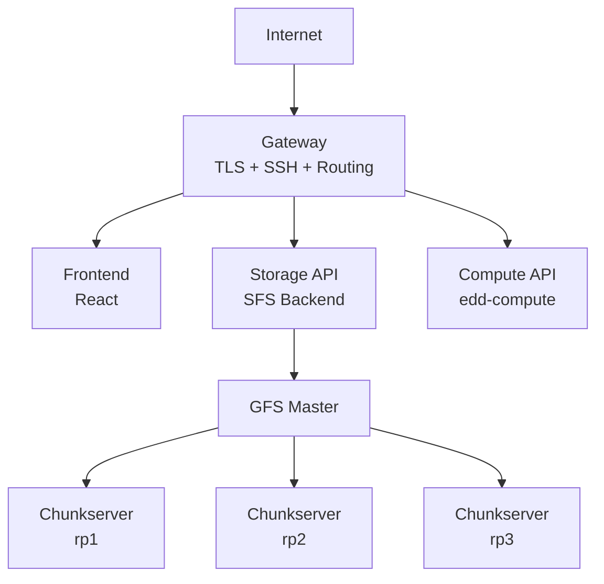
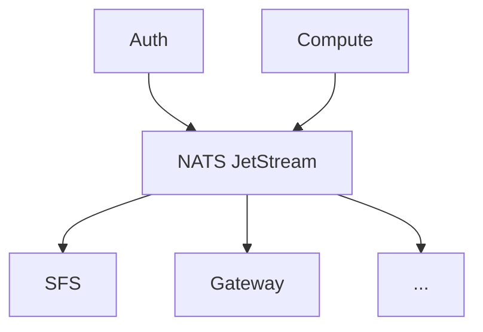

# Architecture

## System Overview

## Request Flow

### Storage Request Flow

1. Client makes HTTPS request to `storage.cloud.eddisonso.com`
2. Gateway terminates TLS and routes to Storage API
3. Storage API authenticates via JWT
4. For file operations:
   - **Write**: Storage API → GFS Master (allocate chunk) → Chunkservers (2PC write)
   - **Read**: Storage API → GFS Master (get locations) → Chunkserver (read data)
5. Response returned to client

### Compute Request Flow

1. Client makes HTTPS request to `compute.cloud.eddisonso.com`
2. Gateway terminates TLS and routes to Compute API
3. Compute API authenticates via JWT
4. Compute API interacts with Kubernetes API for container operations
5. Container status updates streamed via WebSocket

## Data Persistence

### GFS (Distributed File System)

- **Chunk Size**: 64MB
- **Replication Factor**: 3
- **Consistency**: Two-Phase Commit (2PC)
- **Write Quorum**: 2 of 3 replicas

#### Garbage Collection

GFS implements automatic cleanup of orphaned chunks (chunks on disk not tracked by the master):

1. **Chunk Reporting**: Chunkservers report all their chunks during registration and periodic heartbeats
2. **Orphan Detection**: Master checks each reported chunk against its metadata
3. **Grace Period**: Unknown chunks are tracked for 1 hour before deletion (prevents removing in-flight data)
4. **Scheduled Deletion**: After grace period, chunks are added to `pendingDeletes`
5. **Cleanup**: On next heartbeat, master returns pending deletes and chunkserver removes the files

This handles scenarios like:
- Master restart losing in-memory metadata (WAL recovery may miss recent chunks)
- Partial writes that never committed
- Manual file deletions that didn't propagate

### Service Databases

Each service owns its own database for loose coupling:

| Service | Database | Data Stored |
|---------|----------|-------------|
| **Auth** | `auth_db` | Users, sessions |
| **SFS** | `sfs_db` | Namespaces, file metadata |
| **Compute** | `compute_db` | Containers, SSH keys, ingress rules |
| **Gateway** | `gateway_db` | Static routes |

## Network Architecture

### External Domains

| Domain | Purpose |
|--------|---------|
| `cloud.eddisonso.com` | Main dashboard |
| `storage.cloud.eddisonso.com` | Storage API |
| `compute.cloud.eddisonso.com` | Compute API |
| `health.cloud.eddisonso.com` | Health/Monitoring API |
| `docs.cloud.eddisonso.com` | Documentation |

### Internal Services

| Service | Port | Protocol |
|---------|------|----------|
| gateway | 8080/8443/2222 | HTTP/HTTPS/SSH |
| auth-service | 80 | HTTP |
| simple-file-share-backend | 80 | HTTP |
| simple-file-share-frontend | 80 | HTTP |
| edd-compute | 80 | HTTP |
| cluster-monitor | 80 | HTTP |
| log-service | 50051/80 | gRPC/HTTP |
| gfs-master | 9000 | gRPC |
| gfs-chunkserver-N | 8080/8081 | TCP/gRPC |
| postgres | 5432 | PostgreSQL |
| nats | 4222/8222 | NATS/HTTP |

## Event-Driven Communication

Services communicate asynchronously via NATS JetStream:

### Event Subjects

| Subject Pattern | Description |
|-----------------|-------------|
| `auth.user.{id}.created` | User created |
| `auth.user.{id}.deleted` | User deleted |
| `compute.container.{id}.started` | Container started |
| `compute.container.{id}.stopped` | Container stopped |

See [Event-Driven Architecture](./infrastructure/event-driven) for details.

## Security

### Authentication

- JWT-based authentication for API requests
- Tokens issued on login, stored in localStorage
- Token passed via `Authorization: Bearer` header or query param for SSE/WebSocket

### TLS

- All external traffic encrypted with TLS 1.2+
- Certificates managed by cert-manager with Let's Encrypt
- Wildcard certificates for `*.eddisonso.com` and `*.cloud.eddisonso.com`

### CORS

- Each service implements CORS middleware
- Origin header reflected for cross-domain requests
- Credentials allowed for authenticated requests
