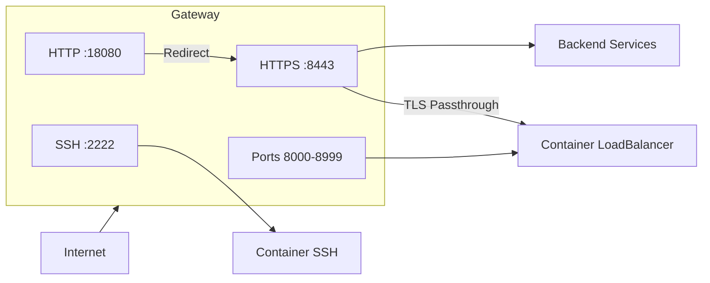

# Gateway

The Gateway service (`edd-cloud-gateway`) is the main entry point for all external traffic. It handles TLS termination, HTTP/HTTPS routing, and SSH tunneling.

## Protocol Support

| Protocol | Status | Notes |
|----------|--------|-------|
| **HTTP/1.1** | Supported | Plain HTTP and after TLS termination |
| **HTTPS/TLS** | Supported | TLS 1.2+, SNI-based routing |
| **SSH** | Supported | Username-based container routing |
| **WebSocket** | Supported | Proxied over HTTP/1.1 |
| **HTTP/2** | Not supported | TLS config only advertises HTTP/1.1 |
| **gRPC** | Not supported | Requires HTTP/2 |
| **HTTP Keep-Alive** | Not supported | Forces `Connection: close` |

### TLS Handling

- **TLS Termination**: For static routes (core services), gateway terminates TLS and proxies plain HTTP to backends
- **TLS Passthrough**: For container routes (`*.compute.cloud.eddisonso.com`), raw TLS is forwarded to the container's LoadBalancer
- **SNI Extraction**: Reads SNI from TLS ClientHello to determine routing before handshake

Container domains follow the pattern `<container-id>.compute.cloud.eddisonso.com` - the gateway detects these by checking for `.compute.cloud.` in the SNI.

### Multi-Protocol Detection (Ports 8000-8999)

The gateway auto-detects protocols on extra ports by inspecting the first bytes:
- `SSH-` → SSH protocol
- `0x16` → TLS handshake
- `GET`, `POST`, etc. → Plain HTTP

## Features

- **TLS Termination**: Handles HTTPS with automatic certificate management
- **Dynamic Routing**: Routes based on host and path prefix from PostgreSQL
- **Route Caching**: LRU cache (100 entries) for O(1) route lookups
- **SSH Tunneling**: Provides SSH access to containers via port 2222
- **WebSocket Support**: Proxies WebSocket connections for real-time features
- **HTTP→HTTPS Redirect**: Automatic upgrade for core services

## Architecture



External ports are mapped as follows:
- Port 22 → Internal 2222 (SSH)
- Port 80 → Internal 18080 (HTTP, redirects to HTTPS)
- Port 443 → Internal 8443 (HTTPS/TLS)
- Ports 8000-8999 → Internal 8000-8999 (Container ingress)

## Routing

Routes are stored in the `static_routes` PostgreSQL table:

```sql
CREATE TABLE static_routes (
    id SERIAL PRIMARY KEY,
    host TEXT NOT NULL,
    path_prefix TEXT NOT NULL,
    target TEXT NOT NULL,
    strip_prefix BOOLEAN DEFAULT false,
    priority INTEGER DEFAULT 0
);
```

### Route Matching

1. Routes are sorted by priority (descending)
2. Host must match exactly
3. Path must start with `path_prefix`
4. First matching route wins

### Route Cache

The gateway uses an LRU (Least Recently Used) cache to optimize route lookups:

- **Cache Size**: 100 entries
- **Key**: `host + path`
- **Hit**: O(1) lookup, bypasses route matching
- **Miss**: Linear scan through routes, result cached
- **Invalidation**: Cache cleared on route table reload

This means repeated requests to the same endpoints are served with minimal overhead, regardless of the total number of routes.

### Example Routes

| Host | Path Prefix | Target |
|------|-------------|--------|
| `storage.cloud.eddisonso.com` | `/` | `simple-file-share-backend:80` |
| `compute.cloud.eddisonso.com` | `/` | `edd-compute:80` |
| `health.cloud.eddisonso.com` | `/` | `cluster-monitor:80` |

## Container Routing

Container traffic is routed separately from static routes. When a request comes in for `<container-id>.compute.cloud.eddisonso.com`:

1. Gateway extracts the container ID from the hostname
2. Looks up the container's ingress rules from the database
3. Maps the external port to the target port
4. Forwards traffic to `lb.<namespace>.svc.cluster.local:<target-port>`

### Ingress Rules

Each container can have multiple ingress rules mapping external ports to internal ports:

| External Port | Target Port | URL |
|---------------|-------------|-----|
| 8080 | 8080 | `http://<id>.compute.cloud.eddisonso.com:8080/` |
| 8443 | 443 | `https://<id>.compute.cloud.eddisonso.com:8443/` |

The gateway reloads container and ingress data every 5 seconds to pick up new rules.

## SSH Tunneling

The gateway provides SSH access to containers:

```bash
ssh <container-id>@compute.cloud.eddisonso.com
```

SSH keys are managed through the Compute API and stored in PostgreSQL.

## Configuration

| Flag | Description | Default |
|------|-------------|---------|
| `-ssh-port` | SSH listen port | 2222 |
| `-http-port` | HTTP listen port | 18080 |
| `-https-port` | HTTPS listen port | 8443 |
| `-tls-cert` | TLS certificate path | - |
| `-tls-key` | TLS private key path | - |
| `-fallback` | Fallback IP for unmatched routes | - |

The gateway also listens on ports 8000-8999 for container ingress traffic using multi-protocol detection.

## Route Configuration

Routes can be configured via a `routes.yaml` file mounted as a ConfigMap:

```yaml
routes:
  - host: cloud-api.eddisonso.com
    path: /compute
    target: edd-compute:80
    strip_prefix: false

  - host: cloud-api.eddisonso.com
    path: /sse/cluster-info
    target: cluster-monitor:80
    strip_prefix: false

  - host: cloud.eddisonso.com
    path: /
    target: simple-file-share-frontend:80
    strip_prefix: false
```

### Updating Routes

1. Edit `edd-gateway/routes.yaml`
2. Apply the ConfigMap:
   ```bash
   kubectl create configmap gateway-routes \
     --from-file=routes.yaml \
     --dry-run=client -o yaml | kubectl apply -f -
   ```
3. Restart the gateway:
   ```bash
   kubectl rollout restart deployment/gateway
   ```

### Route Parameters

| Parameter | Description |
|-----------|-------------|
| `host` | Domain to match (e.g., `cloud-api.eddisonso.com`) |
| `path` | Path prefix to match (e.g., `/compute`) |
| `target` | Backend service and port (e.g., `edd-compute:80`) |
| `strip_prefix` | If `true`, removes the path prefix before forwarding |

## Health Check

```
GET /healthz → 200 OK
GET /readyz → 200 OK
```
