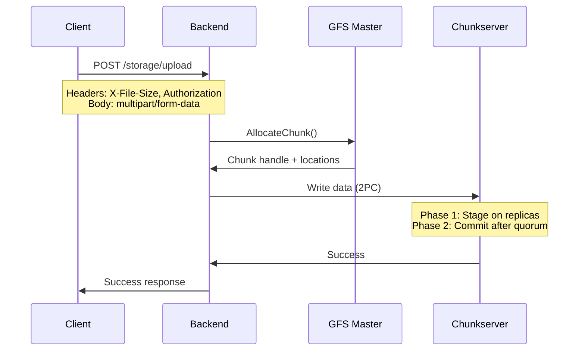
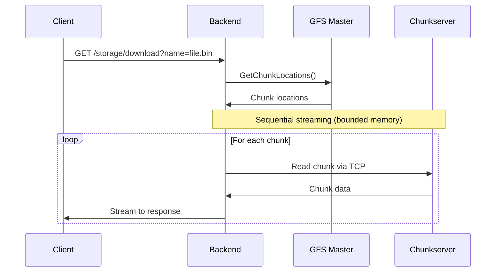

# Storage Service

The Storage Service (SFS - Simple File Share) provides file storage capabilities backed by the GFS distributed file system.

## Features

- **File Upload/Download**: Stream large files with progress tracking
- **Namespaces**: Organize files into logical namespaces
- **Progress Tracking**: Real-time upload/download progress via SSE
- **Authentication**: JWT-based access control

## API Endpoints

### Files

| Method | Endpoint | Description |
|--------|----------|-------------|
| GET | `/storage/files` | List files in namespace |
| POST | `/storage/upload` | Upload a file |
| GET | `/storage/download` | Download a file |
| DELETE | `/storage/delete` | Delete a file |

### Namespaces

| Method | Endpoint | Description |
|--------|----------|-------------|
| GET | `/storage/namespaces` | List namespaces |
| POST | `/storage/namespaces` | Create namespace |
| DELETE | `/storage/namespaces/:name` | Delete namespace |
| PUT | `/storage/namespaces/:name` | Update namespace |

### Progress (SSE)

| Endpoint | Description |
|----------|-------------|
| `/sse/progress?id=<transfer_id>` | Stream transfer progress |

## File Upload Flow



## File Download Flow



Downloads use sequential streaming for memory efficiency:
- Chunks streamed directly to HTTP response
- No buffering of entire chunks in memory
- Constant memory usage regardless of file size
- Automatic failover to replicas on read errors

## Progress Tracking

Progress is tracked via Server-Sent Events (SSE):

```javascript
const eventSource = new EventSource('/sse/progress?id=<transfer_id>');

eventSource.onmessage = (event) => {
  const { bytes, total, done, direction } = JSON.parse(event.data);
  console.log(`${direction}: ${bytes}/${total} bytes`);
};
```

## Namespaces

Namespaces provide logical separation of files:

- `default` - Default namespace for unauthenticated access
- Custom namespaces for user organization
- Hidden namespaces (not shown in UI)

## Configuration

| Flag | Description | Default |
|------|-------------|---------|
| `-addr` | Listen address | `:8080` |
| `-master` | GFS master address | - |
| `-static` | Static files directory | - |

## Database Schema

```sql
-- Namespaces stored in PostgreSQL
CREATE TABLE namespaces (
    name TEXT PRIMARY KEY,
    hidden BOOLEAN DEFAULT false,
    created_at TIMESTAMP DEFAULT NOW()
);
```

Files and chunks are stored in GFS, with metadata managed by the GFS Master.
