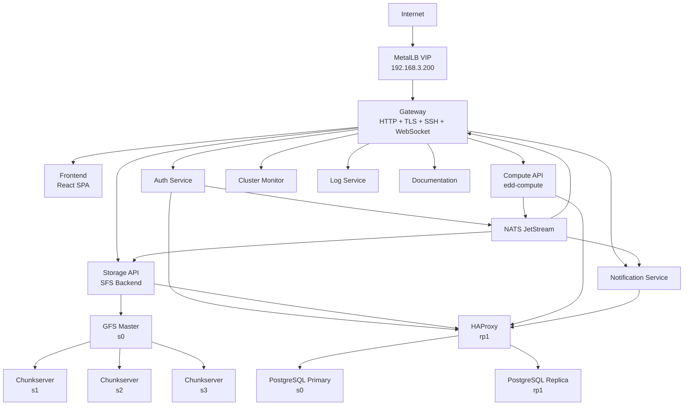
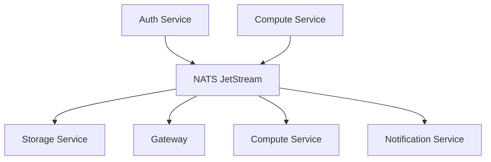

# Architecture

## System Overview

Edd Cloud is a self-hosted cloud platform running on a mixed-architecture K3s cluster. It provides file storage, container compute, authentication, and cluster monitoring through a set of microservices coordinated by a custom gateway and event bus.



## Node Layout

The cluster consists of 8 nodes with mixed architectures:

| Node | Architecture | OS | Role | Labels |
|------|-------------|-----|------|--------|
| s0 | amd64 | Debian 13 (kernel 6.12) | Database primary, GFS master | `db-role=primary`, `core-services=true` |
| rp1 | arm64 | Debian 11 (kernel 6.1) | Database replica, HAProxy | `db-role=replica` |
| rp2 | arm64 | Debian 11 (kernel 6.1) | Backend services | `backend=true` |
| rp3 | arm64 | Debian 11 (kernel 6.1) | Backend services | `backend=true` |
| rp4 | arm64 | Debian 11 (kernel 6.1) | Backend services | `backend=true` |
| s1 | amd64 | Debian 13 (kernel 6.12) | Control plane, etcd, GFS chunkserver | hostNetwork |
| s2 | amd64 | Debian 13 (kernel 6.12) | Control plane, etcd, GFS chunkserver | hostNetwork |
| s3 | amd64 | Debian 13 (kernel 6.12) | Control plane, etcd, GFS chunkserver | hostNetwork |

### Service Distribution

| Node(s) | Services |
|---------|----------|
| s0 | gfs-master, postgres-primary, postgres-replica-s0 |
| rp1 | postgres-replica, haproxy |
| rp2, rp3, rp4 | gateway, auth-service, edd-compute, log-service, NATS, cluster-monitor, simple-file-share, notification-service, edd-cloud-docs, postgres-replicas |
| s1, s2, s3 | k3s control plane, etcd, gfs-chunkservers (hostNetwork) |

## Network Architecture

### Routing and Load Balancing

The cluster uses a custom networking stack -- **not** the default K3s Traefik ingress or ServiceLB:

- **Traefik and k3s ServiceLB (Klipper) are disabled** in `/etc/rancher/k3s/config.yaml`
- **MetalLB** (L2 mode) allocates virtual IPs for `LoadBalancer`-type services
- **Calico** provides pod networking using a VXLAN overlay
- **Gateway VIP**: `192.168.3.200` (allocated by MetalLB)

All external traffic enters the cluster through the custom `edd-gateway`, which handles:

- HTTP/1.1 request routing
- TLS termination (HTTPS)
- SSH tunneling (port 2222) for container access
- WebSocket upgrades

**Note:** The gateway does not currently support HTTP/2 or gRPC pass-through.

### External Domains

| Domain | Purpose | Backend Target |
|--------|---------|----------------|
| `cloud.eddisonso.com` | Main dashboard | simple-file-share-frontend:80 |
| `auth.cloud.eddisonso.com` | Authentication API | auth-service:80 |
| `storage.cloud.eddisonso.com` | Storage API | simple-file-share-backend:80 |
| `compute.cloud.eddisonso.com` | Compute API | edd-compute:80 |
| `health.cloud.eddisonso.com` | Health/Monitoring API, Log streaming | cluster-monitor:80, log-service:80 |
| `notifications.cloud.eddisonso.com` | Notification API | notification-service:80 |
| `docs.cloud.eddisonso.com` | Documentation | edd-cloud-docs:80 |

**`cloud-api.eddisonso.com` is DEPRECATED.** Legacy routes on this domain still exist in the gateway configuration but all new development uses the `*.cloud.eddisonso.com` subdomains.

### Internal Services

| Service | Type | Ports | Protocol |
|---------|------|-------|----------|
| gateway | LoadBalancer | 22, 80, 443, 8000-8999 | SSH/HTTP/HTTPS/Container ingress |
| auth-service | ClusterIP | 80 | HTTP |
| simple-file-share-backend | ClusterIP | 80 | HTTP |
| simple-file-share-frontend | ClusterIP | 80 | HTTP |
| edd-compute | ClusterIP | 80 | HTTP |
| cluster-monitor | ClusterIP | 80 | HTTP |
| log-service | ClusterIP | 50051, 80 | gRPC, HTTP |
| notification-service | ClusterIP | 80 | HTTP, WebSocket |
| gfs-master | ClusterIP | 9000 | gRPC |
| gfs-chunkserver-N | hostNetwork | 8080, 8081 | TCP, gRPC |
| postgres | ClusterIP | 5432 | PostgreSQL |
| haproxy | ClusterIP | 5432 | PostgreSQL |
| nats | ClusterIP | 4222, 8222 | NATS, HTTP |

### DNS

Services communicate internally via Kubernetes DNS:

```
<service>.<namespace>.svc.cluster.local
```

Examples:
- `postgres.default.svc.cluster.local:5432`
- `gfs-master.default.svc.cluster.local:9000`
- `nats.default.svc.cluster.local:4222`

## Request Flows

### Storage Request Flow

1. Client makes HTTPS request to `storage.cloud.eddisonso.com`
2. Gateway terminates TLS and routes to Storage API
3. Storage API authenticates via JWT
4. For file operations:
   - **Write**: Storage API -> GFS Master (allocate chunk) -> Chunkservers (2PC write)
   - **Read**: Storage API -> GFS Master (get locations) -> Chunkserver (read data)
5. Response returned to client

### Compute Request Flow

1. Client makes HTTPS request to `compute.cloud.eddisonso.com`
2. Gateway terminates TLS and routes to Compute API
3. Compute API authenticates via JWT
4. Compute API interacts with Kubernetes API for container operations
5. Container status updates streamed via WebSocket

### SSH Access Flow

1. Client connects to `cloud.eddisonso.com:22` via SSH (port 22 maps to gateway's internal port 2222)
2. Gateway accepts the SSH connection and authenticates using user-uploaded SSH keys
3. Gateway proxies the SSH session to the target user container pod

## Data Persistence

### GFS (Distributed File System)

A custom Go implementation of a distributed file system:

- **Chunk Size**: 64MB
- **Replication Factor**: 3
- **Consistency**: Two-Phase Commit (2PC)
- **Write Quorum**: 2 of 3 replicas
- **Master**: Runs on s0, manages metadata and chunk placement
- **Chunkservers**: Run on s1, s2, s3 using hostNetwork for direct data transfer

#### Garbage Collection

GFS implements automatic cleanup of orphaned chunks (chunks on disk not tracked by the master):

1. **Chunk Reporting**: Chunkservers report all their chunks during registration and periodic heartbeats
2. **Orphan Detection**: Master checks each reported chunk against its metadata
3. **Grace Period**: Unknown chunks are tracked for 1 hour before deletion (prevents removing in-flight data)
4. **Scheduled Deletion**: After grace period, chunks are added to `pendingDeletes`
5. **Cleanup**: On next heartbeat, master returns pending deletes and chunkserver removes the files

This handles scenarios like:
- Master restart losing in-memory metadata (WAL recovery may miss recent chunks)
- Partial writes that never committed
- Manual file deletions that didn't propagate

### Service Databases

PostgreSQL runs in a high-availability configuration with streaming replication:

- **Primary**: s0
- **Replicas**: rp1, rp2, rp3, rp4, s0 (5 replica pods for read scaling and redundancy)
- **HAProxy**: Runs on rp1, provides connection pooling and automatic failover

Each service owns its own database for loose coupling:

| Service | Database | Data Stored |
|---------|----------|-------------|
| **Auth** | `auth_db` | Users, sessions, service accounts |
| **SFS** | `sfs_db` | Namespaces, file metadata |
| **Compute** | `compute_db` | Containers, SSH keys, ingress rules |
| **Notifications** | `notifications_db` | User notifications |
| **Gateway** | `gateway_db` | Static routes |

## Event-Driven Communication

Services communicate asynchronously via NATS JetStream:



### Event Subjects

| Subject Pattern | Description |
|-----------------|-------------|
| `auth.user.{id}.created` | User created |
| `auth.user.{id}.deleted` | User deleted |
| `compute.container.{id}.started` | Container started |
| `compute.container.{id}.stopped` | Container stopped |
| `notify.{user_id}` | Push notification to user |

NATS JetStream provides durable subscriptions, ensuring events are not lost if a consumer is temporarily offline.

See [Event-Driven Architecture](./infrastructure/event-driven) for details.

## Security

### Authentication

- JWT-based authentication for all API requests
- Tokens issued on login, stored in localStorage
- Token passed via `Authorization: Bearer` header or query param for SSE/WebSocket

### Service Account Tokens

- Service accounts support programmatic API access
- Tokens use hierarchical scopes: `service.user_id.resource.id`
- Permissions are pushed to backend services via NATS events for zero-latency local validation
- Example scopes: `compute.uid.containers: ["create", "read", "delete"]`, `storage.uid.files: ["read"]`

### TLS

- All external traffic encrypted with TLS 1.2+
- Certificates managed by cert-manager with Let's Encrypt (Cloudflare DNS-01 challenge)
- Wildcard certificates cover `*.eddisonso.com` and `*.cloud.eddisonso.com`

### Secrets Management

- All secrets stored as Kubernetes Secrets (never environment variables)
- Mounted as files or referenced via `secretKeyRef` in pod specs

| Secret | Purpose |
|--------|---------|
| `postgres-credentials` | PostgreSQL connection string |
| `edd-cloud-auth` | JWT signing secret |
| `eddisonso-wildcard-tls` | TLS certificates |
| `regcred` | Docker registry credentials |

### CORS

- Each service implements CORS middleware
- Origin header reflected for cross-domain requests
- Credentials allowed for authenticated requests

## CI/CD

Deployments are automated via GitHub Actions:

1. Push to `main` branch triggers a workflow
2. GitHub Actions builds the Docker image for the changed service
3. Image is pushed to Docker Hub
4. Kubernetes deployment is updated via `kubectl set image`

Workflow runs are visible at: https://github.com/EddisonSo/cloud/actions
