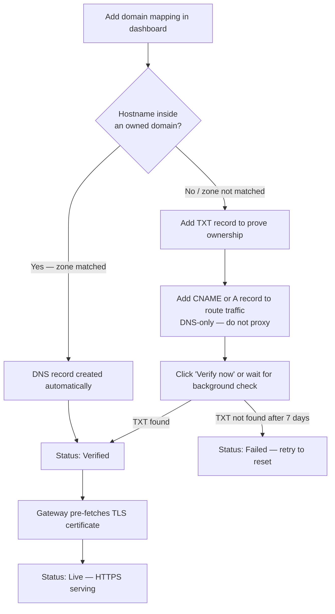

# Domains & Domain Mappings

You can point your own hostname — a subdomain like `app.example.com` or an apex domain like `example.com` — at one of your containers by creating a **domain mapping**. The gateway routes requests for that hostname to your chosen container port and automatically provisions a valid HTTPS certificate via Let's Encrypt. No manual certificate handling is needed.

Two related concepts are involved:

- A **Domain** is a zone you own and have registered with Edd Cloud by supplying a **Cloudflare API token**. Registering a domain lets the platform manage DNS for that zone automatically.
- A **Domain Mapping** attaches a single hostname to a container port. If the hostname falls inside one of your registered domains, DNS is created for you automatically; otherwise you verify ownership manually with a TXT record.

## Prerequisites

- A running container on Edd Cloud
- Control over the hostname's DNS settings (at your registrar or DNS provider)

## Workflow overview

## Domains: Cloudflare-managed DNS (optional)

If your hostname's DNS is managed on Cloudflare, you can skip all manual record setup by registering the zone as a **Domain**. When an owned domain covers a hostname, creating a domain mapping automatically creates the correct DNS record — the mapping goes straight to **Verified** with no TXT record or manual CNAME required.

You can add multiple domains. The typical pattern is one API token per zone (each scoped to Zone:Read + DNS:Edit on only that zone), but a single token that covers several zones works just as well. All domains remain active at the same time — there is no need to remove one before using another.

When you create a domain mapping, the platform automatically selects the domain whose stored zones include the hostname. If no domain matches, it falls back to the standard manual verification flow for that mapping.

### Add a domain

1. In the Cloudflare dashboard, go to **My Profile → API Tokens → Create Token**, then choose **Create Custom Token**.
2. Grant the following permissions — scope them to your specific zone, not "All zones" (unless you want one token to cover multiple zones):
   - **Zone — Zone — Read**
   - **Zone — DNS — Edit**
3. Copy the generated token.
4. In the Edd Cloud dashboard, go to **Networking → Domains** and find the **Domains** card.
5. Paste the token and click **Add domain**. The token is validated immediately — it is rejected if it cannot list your zones. Once accepted, the domain appears in the list with its visible zones.

Repeat for each zone you want covered. Each domain is stored independently and stays active until you remove it.

From that point on, creating a domain mapping whose hostname is inside an owned zone:

- Creates a DNS-only (grey cloud) CNAME in your Cloudflare zone automatically.
- Sets the mapping status to **Verified** immediately.
- Triggers TLS certificate pre-fetch — no further action required.

### Manage your domains

Each domain in the list offers two actions:

- **Refresh** — re-reads the token's zones from Cloudflare and updates the stored snapshot. Use this if you widen the token's scope, or if you use an all-zones token and have added a new zone to your Cloudflare account since registering.
- **Remove** — removes that domain from the platform. Existing domain mappings and their DNS records are left untouched; only the automation for future mappings is removed.

All tokens are stored encrypted.

:::note
If the hostname being mapped falls outside all zones covered by your domains, the platform falls back to the standard manual verification flow for that mapping only.
:::

## Step 1: Add a domain mapping

Open the dashboard at `https://cloud.eddisonso.com` and navigate to **Networking → Domains**.

In the **Domain Mappings** section, click **Add domain mapping** and complete the form:

| Field | What to enter |
|-------|---------------|
| **Container ID** | The ID of the container to receive traffic |
| **Hostname** | The hostname you want to attach (e.g. `app.example.com`) |
| **Target port** | The container port that should receive HTTP traffic: `80`, `443`, or `8000`–`8999` |

Each domain mapping routes to exactly one container port. Once submitted, the mapping appears in the list with status **Pending verification** and the DNS instructions appear inline.

:::note
A hostname can only be mapped once across the entire platform. If you see "domain already in use", it has already been registered by another container.
:::

## Step 2: Prove ownership with a TXT record

The dashboard shows a TXT record to create at your DNS provider. This record proves you control the hostname before any traffic or certificate is issued.

| DNS field | Value |
|-----------|-------|
| **Type** | `TXT` |
| **Name** | `_edd-verify.<your-hostname>` — for example, `_edd-verify.app.example.com` |
| **Value** | The token string shown in the dashboard |

The `_edd-verify` record is used only for the one-time ownership check. It does not carry any traffic and can be removed after the mapping reaches **Verified** status.

## Step 3: Point traffic at the cluster

Once ownership is verified the gateway can route requests to your container, but traffic still needs to reach the cluster. Add a second DNS record for the hostname itself:

**For a subdomain** (e.g. `app.example.com`):

Add a **CNAME** record pointing to `ingress.cloud.eddisonso.com`.

| DNS field | Value |
|-----------|-------|
| **Type** | `CNAME` |
| **Name** | `app.example.com` (or `app` relative to `example.com`) |
| **Value** | `ingress.cloud.eddisonso.com` |

**For an apex/root domain** (e.g. `example.com`):

Apex domains cannot use a CNAME. Add an **A record** pointing to the cluster ingress IP (`192.168.3.200`). Some DNS providers support an **ALIAS** or **ANAME** record type that behaves like a CNAME at the apex — use that if available.

| DNS field | Value |
|-----------|-------|
| **Type** | `A` (or `ALIAS`/`ANAME` if supported) |
| **Name** | `example.com` (apex) |
| **Value** | `192.168.3.200` |

:::warning DNS-only — do not proxy the traffic record
The CNAME or A record that routes traffic to the cluster **must be DNS-only**. On Cloudflare, the cloud icon next to the record must be **grey (DNS only)**, not orange (Proxied).

A proxied record routes requests through Cloudflare's CDN before they reach the cluster. This prevents the platform from completing ACME certificate issuance and causes an HTTP-to-HTTPS redirect loop that makes the hostname unreachable.

This restriction applies only to manually created records. The automatic DNS creation for owned domains (described above) always creates the record with proxying disabled.
:::

Both the TXT record (step 2) and the CNAME/A record (this step) must be in place for the mapping to go fully live.

## Step 4: Verify

Click **Verify now** in the dashboard to trigger an immediate DNS TXT check. A background check also runs automatically every 30 seconds.

Once the gateway finds the matching TXT record, the mapping status changes to **Verified**.

If DNS propagation is slow, wait a few minutes and click **Verify now** again. TXT values are typically propagated within a few minutes, but some providers take longer.

## Step 5: HTTPS goes live automatically

When a mapping transitions to **Verified**, the gateway pre-fetches a Let's Encrypt certificate in the background so the first visitor does not wait for issuance. The status changes to **Live** once the certificate has been issued and served.

On first access to a brand-new hostname the initial request may take a few seconds while the certificate is finalized. Subsequent requests are instant.

## Domain mapping status reference

| Status | Meaning | Next step |
|--------|---------|-----------|
| **Pending verification** | Waiting for the `_edd-verify` TXT record to be found | Add the TXT record and click **Verify now** |
| **Verified** | TXT confirmed; gateway is issuing a certificate | Wait for the certificate pre-fetch to complete |
| **Live** | Certificate issued and serving HTTPS | No action needed |
| **Failed** | TXT record was not found within 7 days | Click **Verify now** (or re-add the mapping) to reset to Pending |

## Notes

- **Deleting a container** removes all of its domain mappings automatically. Any DNS records you created at your provider must be cleaned up manually.
- **One port per mapping**: each domain mapping routes to a single container port. To route multiple ports, add separate mappings.
- **Cert storage**: certificates are stored in the shared database so all gateway replicas serve the same cert — no re-issuance on pod restarts or scaling.

## Troubleshooting

**Mapping stuck on "Pending verification"**

- Confirm the TXT record name is exactly `_edd-verify.<your-hostname>` (not `_edd-verify` alone, and not `_edd-verify.www.<your-hostname>` for a `www` subdomain).
- Confirm the TXT value matches the token shown in the dashboard exactly (no extra spaces or quotes).
- Use a tool such as `dig TXT _edd-verify.app.example.com` or an online DNS checker to confirm the record is visible publicly.
- DNS propagation can take several minutes. Wait and click **Verify now** again.

**HTTPS does not load after the mapping shows "Verified"**

- Confirm the CNAME or A record is in place and resolving to the cluster. Run `dig app.example.com` and verify the answer.
- Confirm the container is running and has an ingress rule on the chosen target port.
- The certificate pre-fetch runs asynchronously; wait 30–60 seconds after **Verified** appears before the first HTTPS request.

**"domain already in use" error when adding**

The hostname is mapped to another container. If you previously mapped it, delete the old entry first, then re-add it.

**Redirect loop, or HTTPS certificate never issues**

Your DNS traffic record is likely proxied through a CDN. Switch the CNAME or A record to DNS-only (the grey cloud icon on Cloudflare). Alternatively, register the zone as a domain in **Networking → Domains** under the **Domains** card and re-add the mapping — the platform will create a correct DNS-only record, replacing the proxied one.
