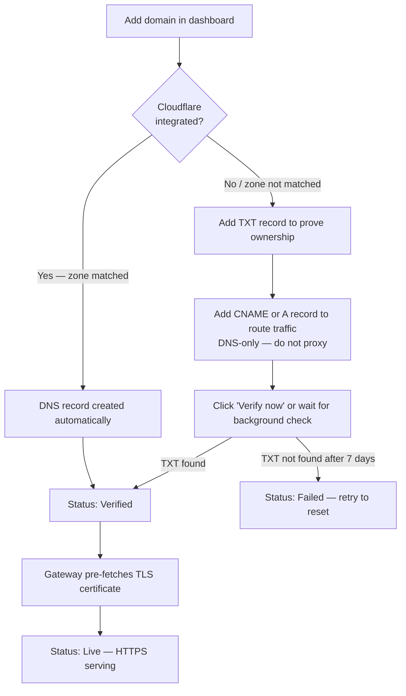

# Custom Domains (Bring Your Own Hostname)

You can point your own domain — a subdomain like `app.example.com` or an apex domain like `example.com` — at one of your containers. The gateway routes requests for that hostname to your chosen container port and automatically provisions a valid HTTPS certificate via Let's Encrypt. No manual certificate handling is needed.

## Prerequisites

- A running container on Edd Cloud
- Control over the domain's DNS settings (at your registrar or DNS provider)

## Workflow overview

## Connect Cloudflare (optional)

If your domain's DNS is managed on Cloudflare, you can skip all manual record setup. When a Cloudflare API token is connected, adding a domain automatically creates the correct DNS record in your zone — the domain goes straight to **Verified** with no TXT record or manual CNAME required.

### Create and connect your token

1. In the Cloudflare dashboard, go to **My Profile → API Tokens → Create Token**, then choose **Create Custom Token**.
2. Grant the following permissions — scope them to your specific zone, not "All zones":
   - **Zone — Zone — Read**
   - **Zone — DNS — Edit**
3. Copy the generated token.
4. In the Edd Cloud dashboard, open the **Networking** tab and find the **Cloudflare integration** card.
5. Paste the token and click **Connect**. The token is validated immediately — it is rejected if it cannot list your zones. Once accepted, the card shows your connected zones.

From that point on, adding a custom domain:

- Creates a DNS-only (grey cloud) CNAME in your Cloudflare zone automatically.
- Sets the domain status to **Verified** immediately.
- Triggers TLS certificate pre-fetch — no further action required.

The token is stored encrypted. You can disconnect it at any time from the same card; disconnecting does not delete existing custom domains or their DNS records.

:::note
If the domain being added falls outside all zones accessible to your token, the platform falls back to the standard manual verification flow for that domain only.
:::

## Step 1: Add a domain

Open the dashboard at `https://cloud.eddisonso.com` and navigate to the **Networking** tab.

Click **Add domain** and complete the form:

| Field | What to enter |
|-------|---------------|
| **Container ID** | The ID of the container to receive traffic |
| **Domain** | The hostname you want to attach (e.g. `app.example.com`) |
| **Target port** | The container port that should receive HTTP traffic: `80`, `443`, or `8000`–`8999` |

Each domain maps to exactly one container port. Once submitted, the domain appears in the list with status **Pending verification** and the DNS instructions appear inline.

:::note
A domain can only be claimed once across the entire platform. If you see "domain already in use", it has already been registered by another container.
:::

## Step 2: Prove ownership with a TXT record

The dashboard shows a TXT record to create at your DNS provider. This record proves you control the domain before any traffic or certificate is issued.

| DNS field | Value |
|-----------|-------|
| **Type** | `TXT` |
| **Name** | `_edd-verify.<your-domain>` — for example, `_edd-verify.app.example.com` |
| **Value** | The token string shown in the dashboard |

The `_edd-verify` record is used only for the one-time ownership check. It does not carry any traffic and can be removed after the domain reaches **Verified** status.

## Step 3: Point traffic at the cluster

Once ownership is verified the gateway can route requests to your container, but traffic still needs to reach the cluster. Add a second DNS record for the domain itself:

**For a subdomain** (e.g. `app.example.com`):

Add a **CNAME** record pointing to `ingress.cloud.eddisonso.com`.

| DNS field | Value |
|-----------|-------|
| **Type** | `CNAME` |
| **Name** | `app.example.com` (or `app` relative to `example.com`) |
| **Value** | `ingress.cloud.eddisonso.com` |

**For an apex/root domain** (e.g. `example.com`):

Apex domains cannot use a CNAME. Add an **A record** pointing to the cluster ingress IP (`192.168.3.200`). Some DNS providers support an **ALIAS** or **ANAME** record type that behaves like a CNAME at the apex — use that if available.

| DNS field | Value |
|-----------|-------|
| **Type** | `A` (or `ALIAS`/`ANAME` if supported) |
| **Name** | `example.com` (apex) |
| **Value** | `192.168.3.200` |

:::warning DNS-only — do not proxy the traffic record
The CNAME or A record that routes traffic to the cluster **must be DNS-only**. On Cloudflare, the cloud icon next to the record must be **grey (DNS only)**, not orange (Proxied).

A proxied record routes requests through Cloudflare's CDN before they reach the cluster. This prevents the platform from completing ACME certificate issuance and causes an HTTP-to-HTTPS redirect loop that makes the domain unreachable.

This restriction applies only to manually created records. The automatic Cloudflare integration (described above) always creates the record with proxying disabled.
:::

Both the TXT record (step 2) and the CNAME/A record (this step) must be in place for the domain to go fully live.

## Step 4: Verify

Click **Verify now** in the dashboard to trigger an immediate DNS TXT check. A background check also runs automatically every 30 seconds.

Once the gateway finds the matching TXT record, the domain status changes to **Verified**.

If DNS propagation is slow, wait a few minutes and click **Verify now** again. TXT values are typically propagated within a few minutes, but some providers take longer.

## Step 5: HTTPS goes live automatically

When a domain transitions to **Verified**, the gateway pre-fetches a Let's Encrypt certificate in the background so the first visitor does not wait for issuance. The status changes to **Live** once the certificate has been issued and served.

On first access to a brand-new domain the initial request may take a few seconds while the certificate is finalized. Subsequent requests are instant.

## Domain status reference

| Status | Meaning | Next step |
|--------|---------|-----------|
| **Pending verification** | Waiting for the `_edd-verify` TXT record to be found | Add the TXT record and click **Verify now** |
| **Verified** | TXT confirmed; gateway is issuing a certificate | Wait for the certificate pre-fetch to complete |
| **Live** | Certificate issued and serving HTTPS | No action needed |
| **Failed** | TXT record was not found within 7 days | Click **Verify now** (or re-add the domain) to reset to Pending |

## Notes

- **Deleting a container** removes all of its custom domains automatically. Any DNS records you created at your provider must be cleaned up manually.
- **One port per domain**: each custom domain routes to a single container port. To route multiple ports, add separate domains.
- **Cert storage**: certificates are stored in the shared database so all gateway replicas serve the same cert — no re-issuance on pod restarts or scaling.

## Troubleshooting

**Domain stuck on "Pending verification"**

- Confirm the TXT record name is exactly `_edd-verify.<your-domain>` (not `_edd-verify` alone, and not `_edd-verify.www.<your-domain>` for a `www` subdomain).
- Confirm the TXT value matches the token shown in the dashboard exactly (no extra spaces or quotes).
- Use a tool such as `dig TXT _edd-verify.app.example.com` or an online DNS checker to confirm the record is visible publicly.
- DNS propagation can take several minutes. Wait and click **Verify now** again.

**HTTPS does not load after the domain shows "Verified"**

- Confirm the CNAME or A record is in place and resolving to the cluster. Run `dig app.example.com` and verify the answer.
- Confirm the container is running and has an ingress rule on the chosen target port.
- The certificate pre-fetch runs asynchronously; wait 30–60 seconds after **Verified** appears before the first HTTPS request.

**"domain already in use" error when adding**

The domain is registered to another container. If you previously registered it, delete the old entry first, then re-add it.

**Redirect loop, or HTTPS certificate never issues**

Your DNS traffic record is likely proxied through a CDN. Switch the CNAME or A record to DNS-only (the grey cloud icon on Cloudflare). Alternatively, connect Cloudflare in the **Networking tab → Cloudflare integration** card and re-add the domain — the platform will create a correct DNS-only record, replacing the proxied one.
