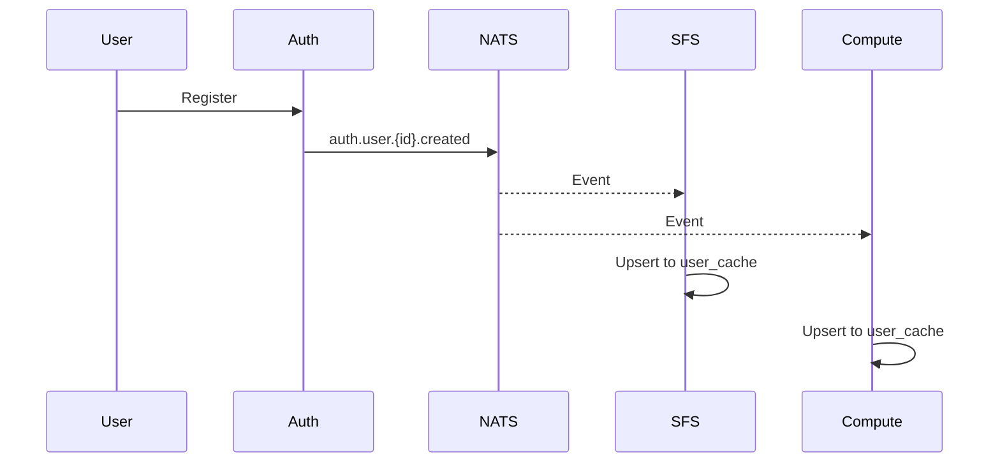
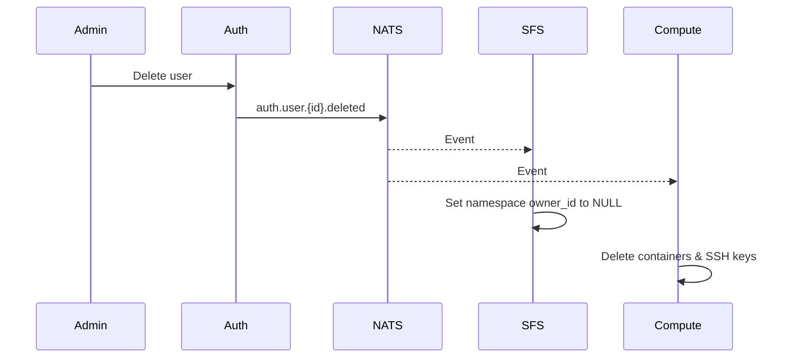
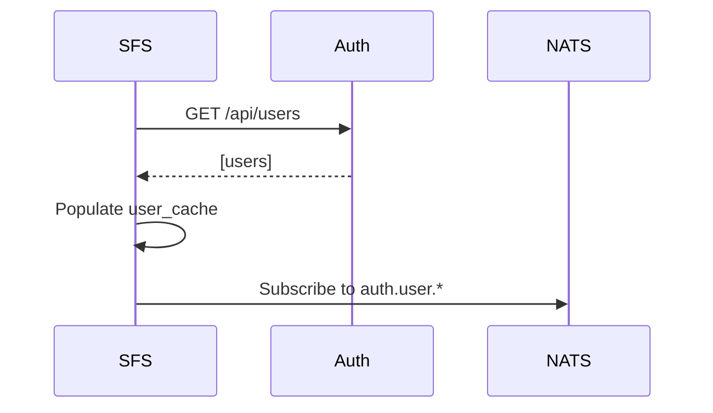

# Event-Driven Architecture

Edd-cloud uses an event-driven architecture for service communication, enabling loose coupling and resilience.

## Overview

Services communicate through events published to NATS JetStream:
- **Publishers**: Emit events when state changes
- **Subscribers**: React to events from other services
- **Persistence**: Events are stored for replay and recovery

## Architecture

Auth-service is the single source of truth for user data. Other services maintain a read-only `user_cache` table populated via NATS events.

```
┌─────────────┐
│ Auth Service│ ─── auth.user.* events ───▶ NATS JetStream
│  (auth_db)  │                                    │
└─────────────┘                     ┌──────────────┼──────────────┐
                                    ▼              ▼              ▼
                              ┌──────────┐  ┌──────────┐  ┌─────────┐  ┌──────────────┐
                              │   SFS    │  │ Compute  │  │ Gateway │  │ Notifications│
                              │ (sfs_db) │  │(compute) │  │(gateway)│  │(notifications)│
                              └──────────┘  └──────────┘  └─────────┘  └──────────────┘
```

## Service Boundaries

Each service owns its data and publishes events for others to consume:

| Service | Database | Owns | Publishes | Subscribes |
|---------|----------|------|-----------|------------|
| **Auth** | `auth_db` | users, sessions | `auth.user.*` (AUTH stream) | - |
| **SFS** | `sfs_db` | namespaces, files, user_cache | - | `auth.user.*` |
| **Compute** | `compute_db` | containers, ssh_keys, user_cache | - | `auth.user.*` |
| **Gateway** | `gateway_db` | routes, ingress_rules | - | - |
| **Notifications** | `notifications_db` | notifications, mutes | `notify.*` (NOTIFICATIONS stream) | `notify.>` |
| **Cluster Monitor** | - | cluster metrics (in-memory) | `cluster.metrics`, `cluster.pods` (CLUSTER stream) | - |
| **Log Service** | - | logs (in-memory ring buffer + GFS) | `log.error.*` (LOGS stream) | - |
| **Alerting** | - | alert rules, cooldown state (in-memory) | - | `cluster.>`, `log.error.>` |

## Event Flow Examples

### User Registration



### User Deletion (Cascade)



### Service Startup Sync

On startup, services fetch all users from auth-service to populate the cache:



## Event Subjects

Events use a hierarchical subject pattern:

```
{service}.{entity}.{id}.{action}
```

### User Events

| Subject | Description |
|---------|-------------|
| `auth.user.{id}.created` | New user registered |
| `auth.user.{id}.deleted` | User was deleted |
| `auth.user.{id}.updated` | User profile updated |

### Cluster Events

| Subject | Description |
|---------|-------------|
| `cluster.metrics` | Node CPU, memory, disk metrics |
| `cluster.pods` | Pod restart count, OOM status |

### Log Events

| Subject | Description |
|---------|-------------|
| `log.error.{source}` | ERROR+ level logs from services |

## Message Formats

Events use **Protocol Buffers** for schema validation and efficient serialization. All messages include a common metadata header:

```protobuf
message EventMetadata {
  string event_id = 1;     // UUID v4
  Timestamp timestamp = 2; // Unix timestamp
  string source = 3;       // Service name (e.g., "cluster-monitor")
}
```

### User Events (JSON)

User events still use JSON for compatibility with existing subscribers:

#### UserCreated

```json
{
  "metadata": {
    "event_id": "uuid-v4",
    "entity_id": "nanoid-user-id",
    "timestamp": 1705920000,
    "source": "auth-service",
    "version": 1
  },
  "user_id": "V1StGXR8_Z5jdHi6B-myT",
  "username": "johndoe",
  "display_name": "John Doe"
}
```

#### UserDeleted

```json
{
  "metadata": {
    "event_id": "uuid-v4",
    "entity_id": "nanoid-user-id",
    "timestamp": 1705920000,
    "source": "auth-service"
  },
  "user_id": "V1StGXR8_Z5jdHi6B-myT",
  "username": "johndoe"
}
```

#### UserUpdated

```json
{
  "metadata": {
    "event_id": "uuid-v4",
    "entity_id": "nanoid-user-id",
    "timestamp": 1705920000,
    "source": "auth-service"
  },
  "user_id": "V1StGXR8_Z5jdHi6B-myT",
  "username": "johndoe",
  "display_name": "John D."
}
```

### Cluster Events (Protobuf)

#### ClusterMetrics

```protobuf
message ClusterMetrics {
  EventMetadata metadata = 1;
  repeated NodeMetrics nodes = 2;
}

message NodeMetrics {
  string name = 1;
  double cpu_percent = 2;
  double memory_percent = 3;
  double disk_percent = 4;
  repeated NodeCondition conditions = 5;
}
```

#### PodStatusSnapshot

```protobuf
message PodStatusSnapshot {
  EventMetadata metadata = 1;
  repeated PodStatus pods = 2;
}

message PodStatus {
  string name = 1;
  string namespace = 2;
  int32 restart_count = 3;
  bool oom_killed = 4;
}
```

### Log Events (Protobuf)

#### LogError

```protobuf
message LogError {
  EventMetadata metadata = 1;
  string source = 2;  // Service name (e.g., "edd-gateway")
  string message = 3; // Error message
  string level = 4;   // "ERROR", "FATAL", etc.
}
```

## User Cache Pattern

Services maintain a local `user_cache` table:

```sql
CREATE TABLE user_cache (
    user_id TEXT PRIMARY KEY,
    username TEXT NOT NULL UNIQUE,
    display_name TEXT NOT NULL DEFAULT '',
    synced_at TIMESTAMP DEFAULT CURRENT_TIMESTAMP
);
```

### Event Handlers

```go
// OnUserCreated - Upsert to cache
func (h *Handler) OnUserCreated(ctx context.Context, event events.UserCreated) error {
    _, err := h.db.Exec(`
        INSERT INTO user_cache (user_id, username, display_name, synced_at)
        VALUES ($1, $2, $3, CURRENT_TIMESTAMP)
        ON CONFLICT (user_id) DO UPDATE SET
            username = EXCLUDED.username,
            display_name = EXCLUDED.display_name,
            synced_at = CURRENT_TIMESTAMP
    `, event.UserID, event.Username, event.DisplayName)
    return err
}

// OnUserDeleted - Remove from cache (FK cascades to owned resources)
func (h *Handler) OnUserDeleted(ctx context.Context, event events.UserDeleted) error {
    _, err := h.db.Exec(`DELETE FROM user_cache WHERE user_id = $1`, event.UserID)
    return err
}
```

## Cascade Deletion

When a user is deleted:

| Service | Action |
|---------|--------|
| **SFS** | Namespace `owner_id` set to NULL (via event handler) |
| **Compute** | Containers deleted (K8s namespace + DB), SSH keys deleted |

## Configuration

Services require these environment variables:

| Variable | Description |
|----------|-------------|
| `NATS_URL` | NATS JetStream URL (e.g., `nats://nats:4222`) |
| `AUTH_SERVICE_URL` | Auth service URL for initial sync (e.g., `http://auth-service:80`) |

## Reliability

### At-Least-Once Delivery

- JetStream persists messages until acknowledged
- Consumers must explicitly acknowledge messages
- Unacknowledged messages are redelivered

### Idempotency

Handlers use upserts to be idempotent:
- `ON CONFLICT DO UPDATE` for creates/updates
- Delete operations are naturally idempotent

### Graceful Degradation

- Services continue working with cached data if NATS is temporarily unavailable
- Initial sync failure logs a warning but doesn't prevent startup

## Benefits

1. **Single Source of Truth**: Auth-service owns user data
2. **Loose Coupling**: Services don't share databases
3. **Resilience**: Events are persisted if a service is down
4. **Scalability**: Multiple consumers can process events in parallel
5. **Eventual Consistency**: Services sync via events, not RPC
