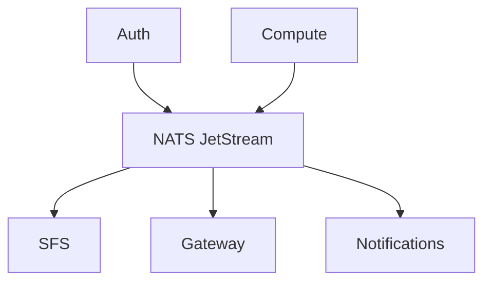

# NATS JetStream

NATS JetStream provides persistent messaging for event-driven communication between services.

## Overview

NATS is used for:
- **Event Publishing**: Services publish events when state changes
- **Event Subscription**: Services subscribe to events they need
- **Decoupling**: Services can operate independently; events are persisted if a subscriber is down

## Architecture



## JetStream Streams

| Stream | Subjects | Retention | Description |
|--------|----------|-----------|-------------|
| `AUTH` | `auth.>` | 7 days | User and session events |
| `COMPUTE` | `compute.>` | 7 days | Container and SSH key events |
| `GATEWAY` | `gateway.>` | 7 days | Routing events |
| `SFS` | `sfs.>` | 7 days | Namespace and file events |
| `NOTIFICATIONS` | `notify.>` | 7 days | Push notifications to users |

## Configuration

### NATS Server Config

```yaml
# nats.conf
port: 4222
http_port: 8222

jetstream {
  store_dir: /data
  max_mem: 512M
  max_file: 4G
}

debug: false
trace: false
logtime: true
```

### Kubernetes Deployment

```yaml
apiVersion: apps/v1
kind: Deployment
metadata:
  name: nats
spec:
  replicas: 1
  template:
    spec:
      nodeSelector:
        size: mini
      containers:
        - name: nats
          image: nats:2.10-alpine
          args:
            - "--config=/etc/nats/nats.conf"
          ports:
            - containerPort: 4222
              name: client
            - containerPort: 8222
              name: monitor
          resources:
            requests:
              memory: 256Mi
              cpu: 100m
            limits:
              memory: 1Gi
              cpu: 500m
          volumeMounts:
            - name: data
              mountPath: /data
            - name: config
              mountPath: /etc/nats
      volumes:
        - name: data
          persistentVolumeClaim:
            claimName: nats-data
        - name: config
          configMap:
            name: nats-config
```

## Service Connection

Services connect to NATS using:

```
nats://nats:4222
```

### Go Client Example

```go
import "github.com/nats-io/nats.go"

// Connect
nc, err := nats.Connect("nats://nats:4222")
js, err := nc.JetStream()

// Publish
js.Publish("auth.user.123.created", data)

// Subscribe
js.Subscribe("auth.user.>", func(msg *nats.Msg) {
    // Handle message
    msg.Ack()
})
```

## Monitoring

NATS exposes monitoring endpoints on port 8222:

| Endpoint | Description |
|----------|-------------|
| `/healthz` | Health check |
| `/varz` | Server statistics |
| `/jsz` | JetStream info |
| `/connz` | Connection info |
| `/subsz` | Subscription info |

### Example

```bash
curl http://nats:8222/jsz
```

## Consumer Configuration

Consumers are configured for reliable delivery:

```go
consumerConfig := &nats.ConsumerConfig{
    Durable:       "service-name",
    AckPolicy:     nats.AckExplicitPolicy,
    MaxDeliver:    5,           // Max retry attempts
    AckWait:       30 * time.Second,
    FilterSubject: "auth.user.>",
}
```

## Ordering Guarantees

- **Per-subject ordering**: Messages within a subject are ordered
- **Subject partitioning**: Use entity IDs in subjects (e.g., `auth.user.{user_id}.created`)
- **Sequence numbers**: JetStream assigns sequence numbers to all messages

## Persistence

Data is stored in a PersistentVolumeClaim:

```yaml
apiVersion: v1
kind: PersistentVolumeClaim
metadata:
  name: nats-data
spec:
  accessModes:
    - ReadWriteOnce
  storageClassName: local-path
  resources:
    requests:
      storage: 5Gi
```
