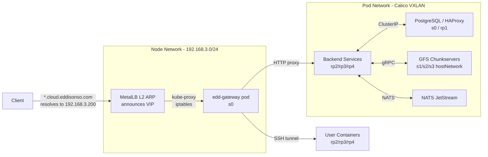
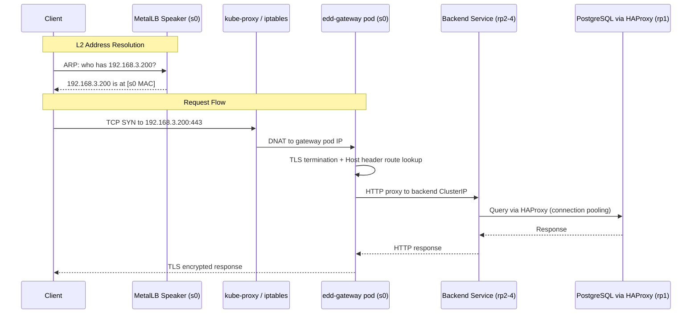

# Networking

## Overview

All external traffic enters the cluster through a single custom gateway (`edd-gateway`) running on s0. The gateway handles TLS termination, protocol detection, request routing, and SSH tunneling. The default K3s networking components (Traefik ingress and servicelb) are disabled.



## Network Stack

### Physical Network

All nodes share a flat L2 network on `192.168.3.0/24`:

| Node | IP | Architecture |
|------|----|-------------|
| s0 | 192.168.3.100 | amd64 |
| s1 | 192.168.3.101 | amd64 |
| s2 | 192.168.3.102 | amd64 |
| s3 | 192.168.3.103 | amd64 |
| rp1 | 192.168.3.201 | arm64 |
| rp2 | 192.168.3.202 | arm64 |
| rp3 | 192.168.3.203 | arm64 |
| rp4 | 192.168.3.204 | arm64 |

### Pod Networking — Calico (VXLAN)

Calico provides the CNI with a VXLAN overlay network. Each node gets a `/26` pod CIDR from the cluster range `10.42.0.0/16`. Cross-node pod traffic is encapsulated in VXLAN tunnels over the physical network.

Key components:
- **calico-node** — DaemonSet running Felix (dataplane programming) and BIRD (route distribution) on every node
- **calico-typha** — Aggregates Kubernetes API watches and fans out to calico-node pods to reduce API server load

### Load Balancing — MetalLB (L2)

MetalLB runs in L2 mode, responding to ARP requests for allocated virtual IPs. When a `LoadBalancer` service is created, MetalLB assigns a VIP from the configured pool and one node's speaker announces it.

| Pool | Range | Purpose |
|------|-------|---------|
| default-pool | 192.168.3.200 | Gateway VIP |
| compute-pool | 192.168.3.150-200 | Compute namespace services |

The gateway service is the primary consumer of MetalLB, receiving VIP `192.168.3.200` for all external traffic on ports 80, 443, and 2222.

**Client Source IP Preservation**: The gateway LoadBalancer uses `externalTrafficPolicy: Local`, which directs kube-proxy to preserve the real client IP address instead of SNAT-ing it to the node IP. Without this, all connections would appear to originate from internal node IPs (e.g., 192.168.3.100), breaking session tracking and IP-based security features.

### Disabled Components

The following K3s defaults are explicitly disabled in `/etc/rancher/k3s/config.yaml`:

- **Traefik** — Replaced by the custom edd-gateway
- **servicelb (Klipper)** — Replaced by MetalLB

## Domain Structure

```
eddisonso.com
├── cloud.eddisonso.com             # Main dashboard (React SPA)
├── auth.cloud.eddisonso.com        # Authentication API
├── storage.cloud.eddisonso.com     # Storage API (SFS)
├── compute.cloud.eddisonso.com     # Compute API
├── health.cloud.eddisonso.com      # Health/Monitoring API + Log streaming
├── notifications.cloud.eddisonso.com  # Notification API + WebSocket push
└── docs.cloud.eddisonso.com        # Documentation site
```

`cloud-api.eddisonso.com` is **deprecated**. All APIs use `*.cloud.eddisonso.com` subdomains.

### DNS Configuration

| Record | Type | Value |
|--------|------|-------|
| `*.eddisonso.com` | A | 192.168.3.200 (gateway VIP) |
| `*.cloud.eddisonso.com` | A | 192.168.3.200 (gateway VIP) |

Both wildcard records resolve to the MetalLB VIP. MetalLB's L2 speaker on s0 responds to ARP for this IP, so the network routes packets directly to s0 where kube-proxy DNATs them to the gateway pod.

### TLS Certificates

Managed by cert-manager using Let's Encrypt with Cloudflare DNS-01 challenge (required for wildcard certs):

```yaml
apiVersion: cert-manager.io/v1
kind: Certificate
metadata:
  name: eddisonso-wildcard
spec:
  secretName: eddisonso-wildcard-tls
  issuerRef:
    name: letsencrypt-cloudflare
    kind: ClusterIssuer
  dnsNames:
    - eddisonso.com
    - "*.eddisonso.com"
    - "*.cloud.eddisonso.com"
```

The gateway loads the wildcard certificate from the `eddisonso-wildcard-tls` Kubernetes secret and terminates TLS for all static routes. For user container HTTPS traffic, the gateway supports TLS passthrough.

## Gateway Routing

The gateway determines the backend target based on the `Host` header and request path. Routes are stored in PostgreSQL (`gateway_db`) and cached in memory with a 100-entry LRU cache.

### Static Routes

| Host | Path | Backend Service |
|------|------|-----------------|
| `cloud.eddisonso.com` | `/` | simple-file-share-frontend:80 |
| `auth.cloud.eddisonso.com` | `/` | auth-service:80 |
| `storage.cloud.eddisonso.com` | `/` | simple-file-share-backend:80 |
| `compute.cloud.eddisonso.com` | `/` | edd-compute:80 |
| `health.cloud.eddisonso.com` | `/` | cluster-monitor:80 |
| `health.cloud.eddisonso.com` | `/logs` | log-service:80 |
| `notifications.cloud.eddisonso.com` | `/` | notification-service:80 |
| `docs.cloud.eddisonso.com` | `/` | edd-cloud-docs:80 |

Route configuration is managed in the `gateway-routes` ConfigMap (`edd-gateway/manifests/gateway-routes.yaml`).

### Route Priority

Routes are matched by priority (highest first):

1. Exact path matches (e.g., `/sse/health`)
2. Prefix matches (e.g., `/compute`)
3. Root path (`/`)

### Container Routing

When a user creates a compute container with ingress rules, the gateway dynamically routes traffic to the container pod. The gateway subscribes to NATS events for container start/stop to update its routing table in real time.

Container traffic on ports 8000-8999 is forwarded directly to user container pods based on the configured ingress rules.

### Protocol Detection

The gateway inspects the first bytes of each connection to determine the protocol:

| Protocol | Detection | Action |
|----------|-----------|--------|
| TLS (0x16) | ClientHello byte | TLS termination or passthrough |
| HTTP | `GET`, `POST`, etc. | Route based on Host header |
| SSH | `SSH-` prefix | Proxy to container SSH |

**Supported:** HTTP/1.1, HTTPS, WebSocket, SSH
**Not supported:** HTTP/2, gRPC passthrough

## SSH Tunneling

The gateway exposes port 2222 for SSH access to user containers:

1. Client connects to `cloud.eddisonso.com:2222`
2. Gateway authenticates using the user's uploaded SSH public keys (stored in compute_db)
3. Gateway resolves the target container pod IP
4. Connection is proxied to the container's SSH daemon

## Connection Pooling (Browser)

Services are split across subdomains to avoid browser connection limits (6 per domain in HTTP/1.1):

| Domain | Connection Usage |
|--------|-----------------|
| `cloud.eddisonso.com` | Dashboard, auth redirects |
| `storage.cloud.eddisonso.com` | File uploads/downloads, SSE progress |
| `compute.cloud.eddisonso.com` | Container CRUD, WebSocket status |
| `health.cloud.eddisonso.com` | Metrics SSE, log streaming SSE |
| `notifications.cloud.eddisonso.com` | Notification API, WebSocket push |

## Internal Network

### Service Discovery

Services communicate internally via Kubernetes DNS:

```
<service>.<namespace>.svc.cluster.local
```

| Service | Address | Protocol |
|---------|---------|----------|
| PostgreSQL (via HAProxy) | `haproxy.default.svc.cluster.local:5432` | PostgreSQL |
| PostgreSQL (direct) | `postgres.default.svc.cluster.local:5432` | PostgreSQL |
| GFS Master | `gfs-master.default.svc.cluster.local:9000` | gRPC |
| NATS | `nats.default.svc.cluster.local:4222` | NATS |
| Log Service (gRPC) | `log-service.default.svc.cluster.local:50051` | gRPC |

### GFS Chunkserver Network

GFS chunkservers run with `hostNetwork: true` on s1, s2, and s3, binding directly to the node IP. This avoids the VXLAN overhead for large data transfers:

| Chunkserver | Address | Ports |
|-------------|---------|-------|
| s1 | 192.168.3.101 | 8080 (data), 8081 (gRPC) |
| s2 | 192.168.3.102 | 8080 (data), 8081 (gRPC) |
| s3 | 192.168.3.103 | 8080 (data), 8081 (gRPC) |

### Internal Service Ports

| Service | Type | Ports | Protocol |
|---------|------|-------|----------|
| gateway | LoadBalancer | 80, 443, 2222, 8000-8999 | HTTP/HTTPS/SSH/TCP |
| auth-service | ClusterIP | 80 | HTTP |
| simple-file-share-backend | ClusterIP | 80 | HTTP |
| simple-file-share-frontend | ClusterIP | 80 | HTTP |
| edd-compute | ClusterIP | 80 | HTTP |
| cluster-monitor | ClusterIP | 80 | HTTP |
| log-service | ClusterIP | 50051, 80 | gRPC, HTTP |
| notification-service | ClusterIP | 80 | HTTP, WebSocket |
| edd-cloud-docs | ClusterIP | 80 | HTTP |
| gfs-master | ClusterIP | 9000 | gRPC |
| gfs-chunkserver-N | hostNetwork | 8080, 8081 | TCP, gRPC |
| postgres | ClusterIP | 5432 | PostgreSQL |
| haproxy | ClusterIP | 5432 | PostgreSQL |
| nats | ClusterIP | 4222, 8222 | NATS, HTTP monitoring |

## CORS Configuration

Each backend service implements CORS middleware. The origin is reflected from the request:

```go
func corsMiddleware(next http.Handler) http.Handler {
    return http.HandlerFunc(func(w http.ResponseWriter, r *http.Request) {
        origin := r.Header.Get("Origin")
        if origin != "" {
            w.Header().Set("Access-Control-Allow-Origin", origin)
            w.Header().Set("Access-Control-Allow-Credentials", "true")
            w.Header().Set("Access-Control-Allow-Methods", "GET, POST, PUT, DELETE, OPTIONS")
            w.Header().Set("Access-Control-Allow-Headers", "Content-Type, Authorization")
        }
        if r.Method == "OPTIONS" {
            w.WriteHeader(http.StatusOK)
            return
        }
        next.ServeHTTP(w, r)
    })
}
```

## Traffic Flow Summary


