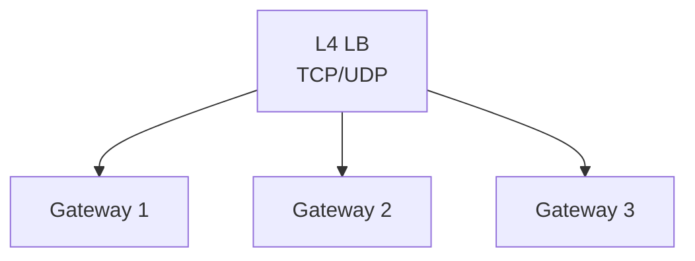

# Roadmap

## Gateway Improvements

- [ ] **IP-based filtering** - Allow/block traffic based on IP address or CIDR range
- [ ] **Radix tree routing** - Replace linear route matching with radix tree for O(log n) lookups
- [ ] **L4 load balancer pre-ingress** - Add TCP/UDP load balancer layer for distributed gateway deployment
- [ ] **Connection pooling** - Reuse backend connections to reduce latency
- [ ] **HTTP/2 support** - Enable gRPC and improved multiplexing

### Distributed Gateway Architecture (Future)

## Storage Improvements

- [x] **Chunk garbage collection** - Clean up orphaned chunks (1-hour grace period, via heartbeat)
- [x] **Namespace visibility levels** - Private (owner only), visible (discoverable), public (read-only access)
- [ ] **Chunk corruption recovery** - Detect corrupted chunks via checksums and re-replicate from healthy replicas
- [ ] **Tiered storage** - Hot/cold data separation
- [ ] **Storage load balancing** - Distribute chunks based on capacity, I/O load, memory, and CPU heuristics
- [ ] **Programmatic API** - Upload and download files via REST API for external integrations
- [ ] **Chunkserver advertise-host flag** - Separate bind address from advertise address to enable Kubernetes deployments without hostNetwork

## Compute Improvements

- [x] **Container access control** - Users can only access their own containers (SSH, logs, management)
- [ ] **Container resource limits** - CPU/memory quotas per user
- [ ] **Container networking** - Private networks between user containers
- [ ] **Persistent volumes** - User-attached storage volumes
- [ ] **True VMs** - Full virtual machines via Type 1 hypervisor (KVM) for stronger isolation
- [x] **Multi-architecture support** - Provision compute on different architectures (amd64, arm64)

## Infrastructure

- [x] **Migrate control plane to s1/s2/s3** - HA control plane with embedded etcd on amd64 nodes
- [x] **Multi-master HA** - 3-node control plane for high availability

## High Availability / Disaster Recovery

*Added after [2026-01-25 s0 node failure incident](./incidents/2026-01-25-s0-node-failure.md)*

- [ ] **GFS master WAL replication** - Replicate chunk metadata to standby masters for redundancy; current single-master design means metadata loss on node failure
- [ ] **GFS metadata in distributed key-value store** - Store file/chunk mappings in etcd or FoundationDB instead of local storage for automatic replication and HA
- [ ] **Automatic database failover** - Implement Patroni or similar for automatic PostgreSQL primary promotion
- [ ] **Service health monitoring** - External uptime checks for critical endpoints
- [ ] **Pod anti-affinity rules** - Spread critical service replicas across nodes
- [x] **CI/CD deployment failure alerts** - Remove silent `|| true` from kubectl commands

## Monitoring

- [ ] **Distributed tracing** - Request tracing across services
- [ ] **Alerting** - Automated alerts for service health
- [ ] **Log aggregation** - Searchable log storage
- [ ] **Distributed logging aggregation** - Replicate log entries across log service replicas so all instances share the same ring buffers and subscribers; enables horizontal scaling without splitting logs across pods
- [ ] **Delta updates for SSE** - Send only changes instead of full state to reduce bandwidth
- [x] **Graph-based observability platform** - Visualize service dependencies and time-series metrics with graph-based relationships

## Auth

- [x] **Token-based RBAC** - Users can create per-user tokens scoped to specific resource permissions (e.g. `compute.uid.containers: ["create", "read", "delete"]`, `storage.uid.files: ["read"]`) for programmatic API access; tokens are tied to the creating user via service accounts
- [x] **Distributed identity permission store** - Auth service pushes service account permissions to compute/storage services via NATS events; services maintain local permission stores for zero-latency token validation without synchronous auth service dependency
- [ ] **OAuth2 / OpenID Connect** - External identity provider integration

## Frontend

- [ ] **Mobile UI** - Fix responsive layout and usability on mobile devices

## Future Services

- [ ] **Message Queue** - Pub/sub messaging for async communication between services
- [ ] **Datastore** - NoSQL database for flexible document/key-value storage
- [ ] **Image Artifactory** - Container image registry for storing and distributing user container images
