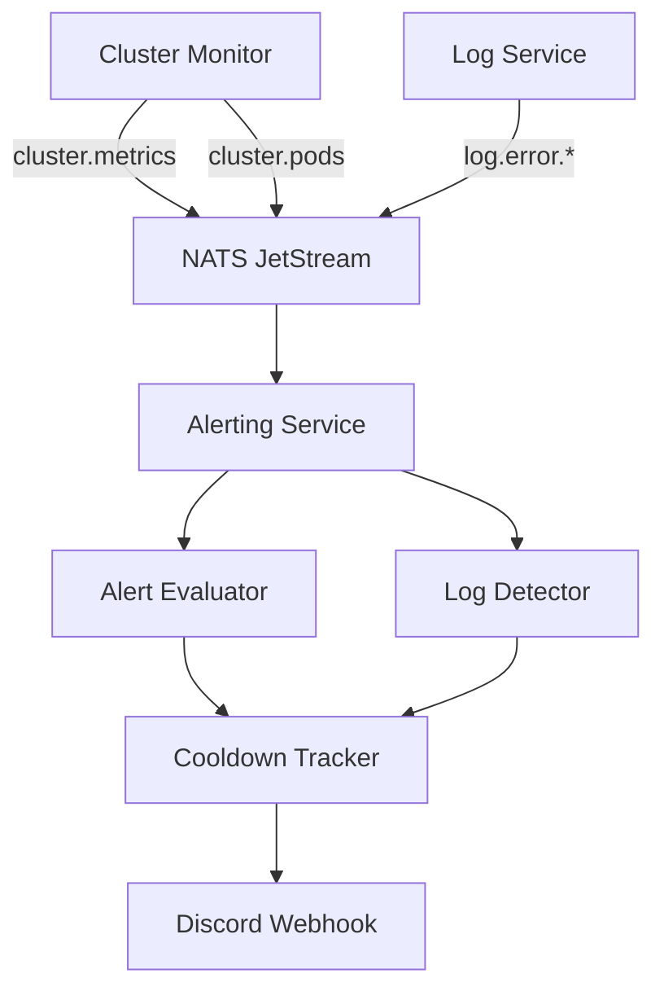

# Alerting Service

The Alerting Service monitors cluster health and service logs, sending Discord notifications for critical conditions.

## Features

- **Cluster Monitoring**: Evaluates node CPU, memory, disk, and pod health
- **Log Monitoring**: Detects critical keywords and error bursts
- **Cooldown Management**: Prevents alert spam with configurable cooldowns
- **Event-Driven**: Consumes NATS events from cluster-monitor and log-service
- **Discord Webhooks**: Sends rich embedded alerts to Discord channels

## Architecture



## Alert Rules

### Cluster Alerts

| Alert Type | Trigger Condition | Severity | Cooldown |
|-----------|-------------------|----------|----------|
| High CPU | Node CPU > 90% for 2 consecutive checks | Critical | 5 minutes |
| High Memory | Node memory > 85% | Warning | 5 minutes |
| High Disk | Node disk > 90% | Warning | 15 minutes |
| Node Condition | Node has MemoryPressure/DiskPressure | Critical | 5 minutes |

### Pod Alerts

| Alert Type | Trigger Condition | Severity | Cooldown |
|-----------|-------------------|----------|----------|
| OOMKilled | Container terminated with OOMKilled | Critical | Per-event (tracks restart count) |
| Pod Restart | Pod restart count increased | Warning | 5 minutes |

### Log Alerts

| Alert Type | Trigger Condition | Severity | Cooldown |
|-----------|-------------------|----------|----------|
| Critical Log | Logs contain "panic", "fatal", "crash" | Critical | 5 minutes |
| Error Burst | 5+ errors in 30s window | Warning | 5 minutes |

## NATS Subscriptions

The service subscribes to:

| Subject Pattern | Description |
|-----------------|-------------|
| `cluster.metrics` | Node CPU, memory, disk metrics |
| `cluster.pods` | Pod restart count, OOM status |
| `log.error.>` | ERROR+ level logs from all services |

All events are Protocol Buffer encoded (see `proto/cluster/events.proto` and `proto/log/events.proto`).

## Discord Webhook Setup

Configure the Discord webhook URL as a Kubernetes secret:

```bash
kubectl create secret generic discord-webhook-url \
  --from-literal=WEBHOOK_URL='https://discord.com/api/webhooks/...'
```

The alerting-service deployment mounts this secret via `secretKeyRef`.

## Alert Message Format

Discord alerts are sent as rich embeds:

```json
{
  "embeds": [{
    "title": "High CPU: s0",
    "description": "Node s0 CPU at 95.2% (threshold: 90%)",
    "color": 16711680,
    "timestamp": "2026-02-14T12:34:56Z"
  }]
}
```

### Severity Colors

| Severity | Color | Hex |
|----------|-------|-----|
| Critical | Red | `0xFF0000` |
| Warning | Orange | `0xFFA500` |

## Cooldown Mechanism

The cooldown tracker prevents duplicate alerts within a time window:

1. Alert fires with key `cpu:s0`
2. Cooldown tracker records `lastFired[cpu:s0] = now`
3. Subsequent alerts with the same key are blocked until cooldown expires
4. After cooldown (default 5 minutes), alerts are allowed again

Different alert types have different cooldowns:
- **Disk alerts**: 15 minutes (disk usage changes slowly)
- **All other alerts**: 5 minutes

### OOMKilled Deduplication

OOMKilled alerts use **restart count tracking** instead of time-based cooldown:

1. When an OOM is detected, record the pod's restart count
2. Subsequent snapshots with the same restart count are ignored (same OOM event)
3. Only fire again when restart count increases (new OOM event)

This prevents duplicate alerts for the same OOM event, which persists in the pod's `LastTerminationState` indefinitely.

## Configuration

| Flag | Description | Default |
|------|-------------|---------|
| `-nats` | NATS server URL | `nats://nats:4222` |
| `-discord-webhook` | Discord webhook URL for alerts | - |
| `-alert-cooldown` | Default alert cooldown duration | `5m` |
| `-cpu-threshold` | CPU alert threshold (%) | `90` |
| `-mem-threshold` | Memory alert threshold (%) | `85` |
| `-disk-threshold` | Disk alert threshold (%) | `90` |
| `-error-burst-threshold` | Error count for burst detection | `5` |
| `-error-burst-window` | Time window for burst detection | `30s` |

## Deployment

The service runs as a single-replica deployment on backend nodes:

```yaml
apiVersion: apps/v1
kind: Deployment
metadata:
  name: alerting-service
spec:
  replicas: 1
  selector:
    matchLabels:
      app: alerting-service
  template:
    metadata:
      labels:
        app: alerting-service
    spec:
      nodeSelector:
        backend: "true"
      containers:
      - name: alerting-service
        image: docker.io/eddisonso/alerting-service:latest
        args:
          - -nats
          - nats://nats:4222
          - -discord-webhook
          - $(DISCORD_WEBHOOK_URL)
        env:
          - name: DISCORD_WEBHOOK_URL
            valueFrom:
              secretKeyRef:
                name: discord-webhook-url
                key: WEBHOOK_URL
```

## Separation of Concerns

Alerting was extracted from cluster-monitor to improve modularity:

| Service | Responsibility |
|---------|---------------|
| **cluster-monitor** | Collect and serve metrics |
| **log-service** | Collect and serve logs |
| **alerting-service** | Evaluate rules and send alerts |

This allows:
- Independent scaling (alerting doesn't affect metric collection)
- Cleaner separation of data collection vs. notification logic
- Easier testing of alert rules
