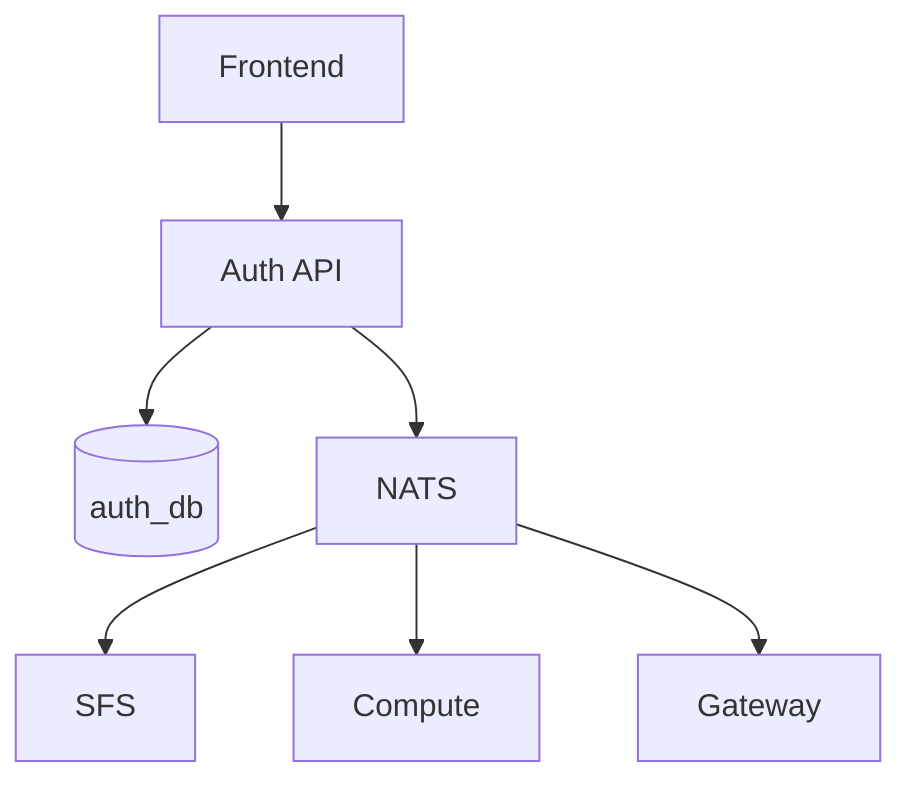

# Auth Service

The Auth service handles user authentication, session management, and JWT token issuance. It is a standalone microservice with its own database.

## Features

- **User Management**: Create, update, and delete users
- **Session Management**: JWT-based authentication with configurable TTL
- **Event Publishing**: Publishes user events to NATS for other services
- **Admin API**: User administration endpoints

## Architecture



## API Endpoints

### Authentication

| Method | Path | Description |
|--------|------|-------------|
| `POST` | `/login` | Authenticate user, returns JWT |
| `POST` | `/logout` | Invalidate session |
| `GET` | `/me` | Get current user info |

### Admin (requires admin role)

| Method | Path | Description |
|--------|------|-------------|
| `GET` | `/admin/users` | List all users |
| `POST` | `/admin/users` | Create new user |
| `DELETE` | `/admin/users/:id` | Delete user |

## Database Schema

```sql
-- Users table
CREATE TABLE users (
    id SERIAL PRIMARY KEY,
    public_id TEXT UNIQUE NOT NULL,      -- 6-char nanoid
    username TEXT UNIQUE NOT NULL,
    display_name TEXT,
    password_hash TEXT NOT NULL,
    created_at TIMESTAMPTZ DEFAULT NOW(),
    updated_at TIMESTAMPTZ DEFAULT NOW()
);

-- Sessions table
CREATE TABLE sessions (
    id TEXT PRIMARY KEY,                  -- UUID
    user_id INTEGER REFERENCES users(id),
    expires_at TIMESTAMPTZ NOT NULL,
    created_at TIMESTAMPTZ DEFAULT NOW()
);
```

## Events Published

The auth service publishes events to NATS when user state changes:

| Subject | Event | Description |
|---------|-------|-------------|
| `auth.user.{id}.created` | `UserCreated` | New user registered |
| `auth.user.{id}.deleted` | `UserDeleted` | User deleted |
| `auth.user.{id}.updated` | `UserUpdated` | User profile updated |
| `auth.session.{id}.created` | `SessionCreated` | User logged in |
| `auth.session.{id}.invalidated` | `SessionInvalidated` | User logged out |
| `auth.identity.{sa_id}.updated` | `IdentityPermissionsUpdated` | Service account permissions changed |
| `auth.identity.{sa_id}.deleted` | `IdentityPermissionsDeleted` | Service account deleted |

## Configuration

### Environment Variables

| Variable | Description | Required |
|----------|-------------|----------|
| `DATABASE_URL` | PostgreSQL connection string | Yes |
| `JWT_SECRET` | Secret for signing JWTs | Yes |
| `ADMIN_USERNAME` | Admin user identifier | Yes |
| `DEFAULT_USERNAME` | Default user to create on startup | Yes |
| `DEFAULT_PASSWORD` | Password for default user | Yes |
| `NATS_URL` | NATS server URL | No |

### Command Line Flags

| Flag | Description | Default |
|------|-------------|---------|
| `-addr` | HTTP listen address | `:8080` |
| `-session-ttl` | Session lifetime | `24h` |
| `-log-service` | Log service gRPC address | (disabled) |

## Deployment

```yaml
apiVersion: apps/v1
kind: Deployment
metadata:
  name: auth-service
spec:
  replicas: 1
  template:
    spec:
      containers:
        - name: auth
          image: eddisonso/edd-cloud-auth:latest
          env:
            - name: DATABASE_URL
              valueFrom:
                secretKeyRef:
                  name: auth-db-credentials
                  key: DATABASE_URL
            - name: JWT_SECRET
              valueFrom:
                secretKeyRef:
                  name: jwt-secret
                  key: secret
            - name: NATS_URL
              value: "nats://nats:4222"
```

## JWT Token Structure

```json
{
  "user_id": 1,
  "username": "user@example.com",
  "display_name": "User Name",
  "exp": 1234567890,
  "iat": 1234567890
}
```

## Health Check

```
GET /healthz → 200 OK
```
