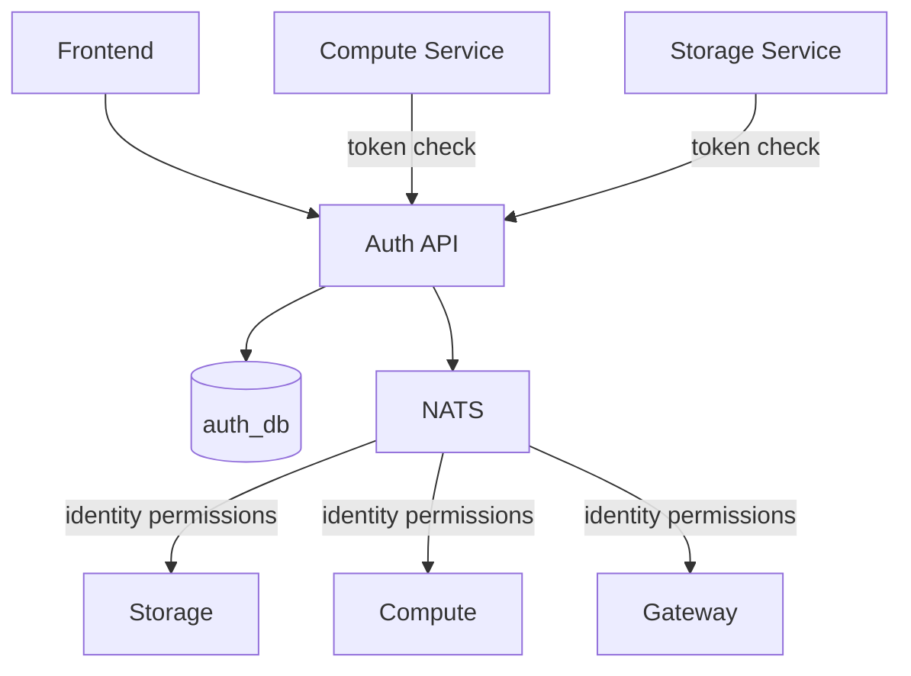

# Auth Service

The Auth service handles user authentication, session management, API tokens, and service account permissions. It is the single source of truth for identity and authorization across all services.

## Features

- **User Management**: Create, update, and delete users
- **Session Management**: JWT-based authentication with configurable TTL
- **API Tokens**: Scoped tokens for programmatic access (`ecloud_` prefixed)
- **Service Accounts**: Identity-based permission model with NATS-pushed scopes
- **Event Publishing**: Publishes user and identity events to NATS
- **Token Validation**: Service-to-service endpoint for token revocation and permission checks
- **Rate Limiting**: IP-based and user-based rate limiting on login

## Architecture



## Access Control

### Session Auth (website only)

Token and service account management requires a session JWT obtained by logging in through the web dashboard. API tokens **cannot** be used to create, modify, or delete tokens or service accounts.

Operations requiring session auth:
- Create / list API tokens
- Create / list / update / delete service accounts
- Create / list service account tokens

### Token Permission Reads

The auth service is the **only** service that can read permissions for a given token. Other services (compute, storage) validate API tokens by calling the auth service's `/api/tokens/{id}/check` endpoint with a service key. This ensures the auth service remains the single source of truth for revocation and scope changes.

### Service-to-Service Auth

Internal endpoints use `X-Service-Key` header authentication. These are not accessible from the public internet.

## API Endpoints

Base URL: `https://auth.cloud.eddisonso.com`

### Authentication

| Method | Path | Auth | Description |
|--------|------|------|-------------|
| `POST` | `/api/login` | None | Authenticate user, returns JWT |
| `POST` | `/api/logout` | Session | Invalidate session |
| `GET` | `/api/session` | Session | Get current session info |

### API Tokens

| Method | Path | Auth | Description |
|--------|------|------|-------------|
| `POST` | `/api/tokens` | Session | Create a new API token |
| `GET` | `/api/tokens` | Session | List user's API tokens |

### Service Accounts

| Method | Path | Auth | Description |
|--------|------|------|-------------|
| `POST` | `/api/service-accounts` | Session | Create a service account |
| `GET` | `/api/service-accounts` | Session | List user's service accounts |
| `GET` | `/api/service-accounts/{id}` | Session | Get service account details |
| `PUT` | `/api/service-accounts/{id}/scopes` | Session | Update service account scopes |
| `DELETE` | `/api/service-accounts/{id}` | Session | Delete a service account |
| `POST` | `/api/service-accounts/{id}/tokens` | Session | Create a token for a service account |
| `GET` | `/api/service-accounts/{id}/tokens` | Session | List tokens for a service account |

### Service-to-Service (internal)

| Method | Path | Auth | Description |
|--------|------|------|-------------|
| `GET` | `/api/tokens/{id}/check` | Service key | Check token validity and get scopes |
| `GET` | `/api/users` | Service key | List all users |
| `GET` | `/api/identity-permissions` | Service key | List all service account permissions |

### Admin (requires admin role)

| Method | Path | Auth | Description |
|--------|------|------|-------------|
| `GET` | `/admin/users` | Admin session | List all users |
| `POST` | `/admin/users` | Admin session | Create new user |
| `DELETE` | `/admin/users` | Admin session | Delete user |
| `GET` | `/admin/sessions` | Admin session | List active sessions |

## Token Types

### Session JWT

Issued on login, stored as a cookie. Used for web dashboard access.

```json
{
  "user_id": "abc123",
  "username": "eddison",
  "display_name": "Eddison",
  "exp": 1707436800,
  "iat": 1707350400
}
```

### API Token

Prefixed with `ecloud_`, contains scoped permissions. Used for programmatic API access.

```json
{
  "user_id": "abc123",
  "token_id": "tok_xyz",
  "type": "api_token",
  "scopes": {
    "compute.abc123.containers": ["create", "read", "delete"],
    "storage.abc123.files": ["read"]
  }
}
```

### Scope Format

Scopes follow the pattern: `<root>.<user_id>[.<resource>[.<id>]]`

| Root | Resources |
|------|-----------|
| `compute` | `containers`, `keys` |
| `storage` | `namespaces`, `files` |

Actions: `create`, `read`, `update`, `delete`

Scopes cascade — `compute.uid.containers` with `read` grants read access to all containers, while `compute.uid.containers.abc` with `read` grants access to only that container.

## Database Schema

```sql
CREATE TABLE users (
    id SERIAL PRIMARY KEY,
    public_id TEXT UNIQUE NOT NULL,
    username TEXT UNIQUE NOT NULL,
    display_name TEXT,
    password_hash TEXT NOT NULL,
    created_at TIMESTAMPTZ DEFAULT NOW(),
    updated_at TIMESTAMPTZ DEFAULT NOW()
);

CREATE TABLE sessions (
    id TEXT PRIMARY KEY,
    user_id INTEGER REFERENCES users(id),
    expires_at TIMESTAMPTZ NOT NULL,
    created_at TIMESTAMPTZ DEFAULT NOW()
);

CREATE TABLE api_tokens (
    id TEXT PRIMARY KEY,
    user_id TEXT NOT NULL,
    name TEXT NOT NULL,
    token_hash TEXT NOT NULL,
    scopes JSONB NOT NULL DEFAULT '{}',
    expires_at BIGINT DEFAULT 0,
    last_used_at BIGINT DEFAULT 0,
    service_account_id TEXT REFERENCES service_accounts(id),
    created_at BIGINT NOT NULL
);

CREATE TABLE service_accounts (
    id TEXT PRIMARY KEY,
    user_id TEXT NOT NULL,
    name TEXT NOT NULL,
    scopes JSONB NOT NULL DEFAULT '{}',
    version BIGINT DEFAULT 1,
    created_at BIGINT NOT NULL
);
```

## Events Published

| Subject | Description |
|---------|-------------|
| `auth.user.{id}.created` | New user registered |
| `auth.user.{id}.deleted` | User deleted |
| `auth.user.{id}.updated` | User profile updated |
| `auth.session.{id}.created` | User logged in |
| `auth.session.{id}.invalidated` | User logged out |
| `auth.identity.{sa_id}.updated` | Service account permissions changed |
| `auth.identity.{sa_id}.deleted` | Service account deleted |

## Configuration

| Flag | Description | Default |
|------|-------------|---------|
| `-addr` | HTTP listen address | `:8080` |
| `-session-ttl` | Session lifetime | `24h` |
| `-log-service` | Log service gRPC address | (disabled) |

| Env Variable | Description |
|-------------|-------------|
| `DATABASE_URL` | PostgreSQL connection string |
| `JWT_SECRET` | Secret for signing JWTs |
| `ADMIN_USERNAME` | Admin user identifier |
| `DEFAULT_USERNAME` | Default user to create on startup |
| `DEFAULT_PASSWORD` | Password for default user |
| `NATS_URL` | NATS server URL |
| `SERVICE_API_KEY` | Shared key for service-to-service auth |

## Health Check

```
GET /healthz → 200 OK
```
