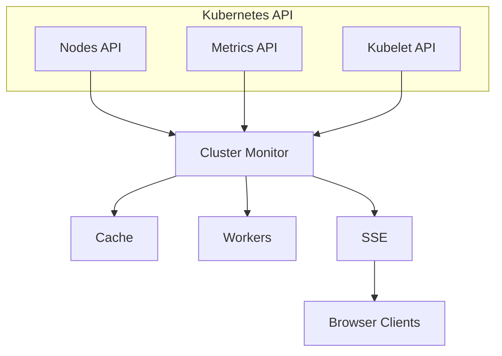

# Cluster Monitor

The Cluster Monitor service provides real-time metrics and health information for the Kubernetes cluster.

## Features

- **Node Metrics**: CPU, memory, disk usage per node
- **Pod Metrics**: Resource usage per pod
- **Health Status**: Node conditions and pressure indicators
- **Real-time Streaming**: SSE-based metrics updates
- **Event Publishing**: Publishes cluster metrics to NATS for alerting-service consumption

## Architecture



## API Endpoints

### REST

| Endpoint | Description |
|----------|-------------|
| `GET /cluster-info` | Current node metrics (JSON) |
| `GET /pod-metrics` | Current pod metrics (JSON) |
| `GET /healthz` | Health check |

### SSE (Real-time)

| Endpoint | Description |
|----------|-------------|
| `GET /sse/health` | Combined cluster + pod metrics stream |
| `GET /sse/cluster-info` | Node metrics stream |
| `GET /sse/pod-metrics` | Pod metrics stream |

### WebSocket (Legacy)

| Endpoint | Description |
|----------|-------------|
| `WS /ws/cluster-info` | Node metrics WebSocket |
| `WS /ws/pod-metrics` | Pod metrics WebSocket |

## Metrics

### Node Metrics

```json
{
  "timestamp": "2024-01-19T12:34:56Z",
  "nodes": [
    {
      "name": "s0",
      "cpu_usage": "500m",
      "cpu_capacity": "4",
      "cpu_percent": 12.5,
      "memory_usage": "2Gi",
      "memory_capacity": "8Gi",
      "memory_percent": 25.0,
      "disk_usage": 10737418240,
      "disk_capacity": 107374182400,
      "disk_percent": 10.0,
      "conditions": [
        {"type": "MemoryPressure", "status": "False"},
        {"type": "DiskPressure", "status": "False"}
      ]
    }
  ]
}
```

### Pod Metrics

```json
{
  "timestamp": "2024-01-19T12:34:56Z",
  "pods": [
    {
      "name": "gateway-abc123",
      "namespace": "core",
      "node": "s0",
      "cpu_usage": 50000000,
      "cpu_capacity": 4000000000,
      "memory_usage": 67108864,
      "memory_capacity": 8589934592,
      "disk_usage": 1048576,
      "disk_capacity": 107374182400
    }
  ]
}
```

## Combined Health Stream

The `/sse/health` endpoint combines both metrics types to reduce connections:

```javascript
const eventSource = new EventSource('/sse/health');

eventSource.onmessage = (event) => {
  const { type, payload } = JSON.parse(event.data);

  if (type === 'cluster') {
    // Node metrics
    updateNodes(payload.nodes);
  } else if (type === 'pods') {
    // Pod metrics
    updatePods(payload.pods);
  }
};
```

## Refresh Interval

Metrics are fetched from the Kubernetes API every 5 seconds (configurable).

## Event Publishing

Cluster Monitor publishes metrics to NATS JetStream for consumption by the alerting-service:

### Published Subjects

| Subject | Description | Publish Frequency |
|---------|-------------|-------------------|
| `cluster.metrics` | Node CPU, memory, disk, conditions | Every 5s |
| `cluster.pods` | Pod restart count, OOM status | Every 5s |

Events are serialized as Protocol Buffers (see `proto/cluster/events.proto`).

### NATS Stream Configuration

```yaml
Stream: CLUSTER
Subjects: cluster.>
Retention: LimitsPolicy
MaxMsgs: 1,000,000
MaxBytes: 1 GB
MaxAge: 7 days
Storage: FileStorage
```

Cluster Monitor creates the CLUSTER stream on startup if it doesn't exist. Publishing is non-blocking — metrics continue to work even if NATS is unavailable.

## Configuration

| Flag | Description | Default |
|------|-------------|---------|
| `-addr` | Listen address | `:8080` |
| `-refresh` | Metrics refresh interval | `5s` |
| `-api-server` | Kubernetes API server address | - |
| `-log-service` | Log service gRPC address for structured logging | - |
| `-log-source` | Log source name (pod name) | `cluster-monitor` |
| `-nats` | NATS server URL | `nats://nats:4222` |
