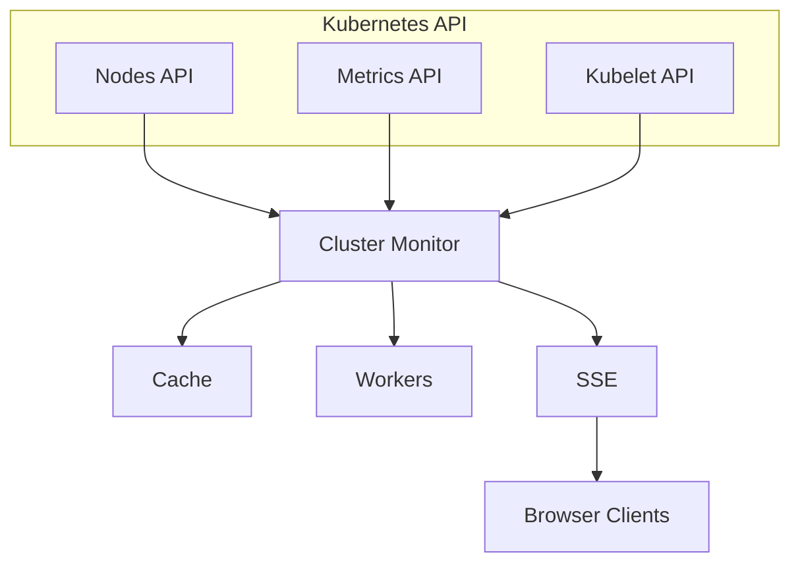

# Cluster Monitor

The Cluster Monitor service provides real-time metrics and health information for the Kubernetes cluster.

## Features

- **Node Metrics**: CPU, memory, disk usage per node
- **Pod Metrics**: Resource usage per pod
- **Health Status**: Node conditions and pressure indicators
- **Real-time Streaming**: SSE-based metrics updates
- **Event Publishing**: Publishes cluster metrics to NATS for alerting-service consumption

## Architecture


```mermaid
flowchart TB
    subgraph K8s[Kubernetes API]
        Nodes[Nodes API]
        Metrics[Metrics API]
        Kubelet[Kubelet API]
    end

    Nodes --> CM[Cluster Monitor]
    Metrics --> CM
    Kubelet --> CM

    CM --> Cache[Cache]
    CM --> Workers[Workers]
    CM --> SSE[SSE]

    SSE --> Clients[Browser Clients]
```

## Authentication and Access Control

Cluster Monitor enforces JWT-based authentication and role-based access on all metrics endpoints:

- **Admin-only endpoints** — require a valid JWT with `IsAdmin: true` (issued by the auth service). Non-admin tokens receive `403`. Unauthenticated requests receive `401`.
- **Authenticated endpoints (own pods)** — require a valid JWT. Results are automatically filtered to the caller's own containers (`compute-{userID}-*` namespaces). The `core` system namespace is excluded for non-admins.
- **`/healthz`** — unauthenticated health probe only; no metrics data.

The `IsAdmin` claim is set by the auth service at login time based on the `ADMIN_USERNAME` environment variable. Admin tokens must be reissued (re-login) to pick up this claim.

## API Endpoints

### REST

| Endpoint | Auth | Description |
|----------|------|-------------|
| `GET /cluster-info` | Admin only | Current node metrics for all cluster nodes (JSON) |
| `GET /pod-metrics` | JWT required | Pod metrics filtered to the caller's own containers |
| `GET /api/metrics/nodes` | Admin only | Node metrics (same data as `/cluster-info`, REST path) |
| `GET /api/metrics/pods` | JWT required | Pod metrics; `namespace` query param honored only for the caller's own namespaces |
| `GET /api/graph/dependencies` | Admin only | Cluster service dependency graph |
| `GET /healthz` | None | Liveness/readiness health check |

### SSE (Real-time)

| Endpoint | Auth | Description |
|----------|------|-------------|
| `GET /sse/health` | JWT required | Combined cluster + pod metrics stream (pods filtered to caller's own) |
| `GET /sse/cluster-info` | Admin only | Node metrics stream for all cluster nodes |
| `GET /sse/pod-metrics` | JWT required | Pod metrics stream filtered to the caller's own containers |

### WebSocket (Legacy)

| Endpoint | Auth | Description |
|----------|------|-------------|
| `WS /ws/cluster-info` | Admin only | Node metrics WebSocket (all nodes) |
| `WS /ws/pod-metrics` | JWT required | Pod metrics WebSocket filtered to the caller's own containers |

## Metrics

### Node Metrics

```json
{
  "timestamp": "2024-01-19T12:34:56Z",
  "nodes": [
    {
      "name": "s0",
      "cpu_usage": "500m",
      "cpu_capacity": "4",
      "cpu_percent": 12.5,
      "memory_usage": "2Gi",
      "memory_capacity": "8Gi",
      "memory_percent": 25.0,
      "disk_usage": 10737418240,
      "disk_capacity": 107374182400,
      "disk_percent": 10.0,
      "conditions": [
        {"type": "MemoryPressure", "status": "False"},
        {"type": "DiskPressure", "status": "False"}
      ]
    }
  ]
}
```

### Pod Metrics

Non-admin callers receive only pods in their own `compute-{userID}-*` namespace(s). The `core` system namespace is visible to admins only.

```json
{
  "timestamp": "2024-01-19T12:34:56Z",
  "pods": [
    {
      "name": "myapp-abc123",
      "namespace": "compute-usr_abc123-main",
      "node": "rp2",
      "cpu_usage": 50000000,
      "cpu_capacity": 4000000000,
      "memory_usage": 67108864,
      "memory_capacity": 8589934592,
      "disk_usage": 1048576,
      "disk_capacity": 107374182400
    }
  ]
}
```

## Combined Health Stream

The `/sse/health` endpoint combines both metrics types to reduce connections:

```javascript
const eventSource = new EventSource('/sse/health');

eventSource.onmessage = (event) => {
  const { type, payload } = JSON.parse(event.data);

  if (type === 'cluster') {
    // Node metrics
    updateNodes(payload.nodes);
  } else if (type === 'pods') {
    // Pod metrics
    updatePods(payload.pods);
  }
};
```

## Refresh Interval

Metrics are fetched from the Kubernetes API every 5 seconds (configurable).

## Event Publishing

Cluster Monitor publishes metrics to NATS JetStream for consumption by the alerting-service:

### Published Subjects

| Subject | Description | Publish Frequency |
|---------|-------------|-------------------|
| `cluster.metrics` | Node CPU, memory, disk, conditions | Every 5s |
| `cluster.pods` | Pod restart count, OOM status | Every 5s |

Events are serialized as Protocol Buffers (see `proto/cluster/events.proto`).

### NATS Stream Configuration

```yaml
Stream: CLUSTER
Subjects: cluster.>
Retention: LimitsPolicy
MaxMsgs: 1,000,000
MaxBytes: 1 GB
MaxAge: 7 days
Storage: FileStorage
```

Cluster Monitor creates the CLUSTER stream on startup if it doesn't exist. Publishing is non-blocking — metrics continue to work even if NATS is unavailable.

## Configuration

| Flag | Description | Default |
|------|-------------|---------|
| `-addr` | Listen address | `:8080` |
| `-refresh` | Metrics refresh interval | `5s` |
| `-api-server` | Kubernetes API server address | - |
| `-log-service` | Log service gRPC address for structured logging | - |
| `-log-source` | Log source name (pod name) | `cluster-monitor` |
| `-nats` | NATS server URL | `nats://nats:4222` |
