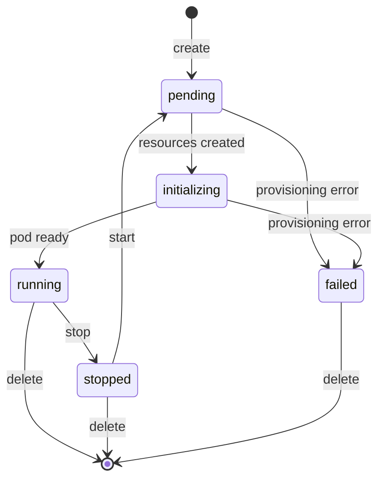

# Compute Service

The Compute Service manages containers running on the Kubernetes cluster. It provides a simplified interface for container lifecycle management.

## Features

- **Container Management**: Create, start, stop, delete containers
- **Custom Images**: Launch containers from images stored in the internal registry (`registry.cloud.eddisonso.com`)
- **Image Pull Policy**: Per-container pull policy (`Always` or `IfNotPresent`, default `IfNotPresent`)
- **SSH Access**: Enable SSH access to containers
- **Port Forwarding**: Expose container ports via ingress rules
- **Persistent Storage**: Configurable persistent mount paths (default `/root`)
- **Log Streaming**: Stream container stdout/stderr over WebSocket
- **Web Terminal**: Interactive in-browser terminal over WebSocket
- **Real-time Updates**: WebSocket-based status updates

## API Endpoints

### Containers

| Method | Endpoint | Description |
|--------|----------|-------------|
| GET | `/compute/containers` | List user's containers |
| POST | `/compute/containers` | Create container |
| GET | `/compute/containers/:id` | Get a single container |
| DELETE | `/compute/containers/:id` | Delete container |
| POST | `/compute/containers/:id/start` | Start container |
| POST | `/compute/containers/:id/stop` | Stop container |
| PUT | `/compute/containers/:id/pull-policy` | Update image pull policy |

### Images

| Method | Endpoint | Description |
|--------|----------|-------------|
| GET | `/compute/images` | List available container images (builtin + registry) |

### SSH Keys

| Method | Endpoint | Description |
|--------|----------|-------------|
| GET | `/compute/ssh-keys` | List SSH keys |
| POST | `/compute/ssh-keys` | Add SSH key |
| DELETE | `/compute/ssh-keys/:id` | Remove SSH key |

### Container Access

| Method | Endpoint | Description |
|--------|----------|-------------|
| GET | `/compute/containers/:id/ssh` | Get SSH status |
| PUT | `/compute/containers/:id/ssh` | Toggle SSH access |
| GET | `/compute/containers/:id/ingress` | List ingress rules |
| POST | `/compute/containers/:id/ingress` | Add ingress rule |
| DELETE | `/compute/containers/:id/ingress/:port` | Remove ingress rule |
| GET | `/compute/containers/:id/mounts` | List persistent mount paths |
| PUT | `/compute/containers/:id/mounts` | Update persistent mount paths |

### WebSocket

| Method | Endpoint | Description |
|--------|----------|-------------|
| GET | `/compute/ws` | Real-time container status updates |
| GET | `/compute/containers/:id/terminal` | Interactive web terminal |
| GET | `/compute/containers/:id/logs` | Container log stream |

### Admin

| Method | Endpoint | Description |
|--------|----------|-------------|
| GET | `/compute/admin/containers` | List all containers across users (admin only) |

## Container Lifecycle



Status values: `pending`, `initializing`, `running`, `stopped`, `failed`. A newly created container goes `pending -> initializing -> running` as its Kubernetes resources are provisioned and the pod becomes ready (it is never `stopped` on create). Starting a stopped container returns it to `pending` and it polls back through to `running`.

## WebSocket Updates

Real-time container status via WebSocket:

```javascript
const ws = new WebSocket('wss://compute.cloud.eddisonso.com/compute/ws');

ws.onmessage = (event) => {
  const msg = JSON.parse(event.data);

  if (msg.type === 'containers') {
    // Full container list
    console.log(msg.data);
  } else if (msg.type === 'container_status') {
    // Status update for single container
    console.log(msg.data.container_id, msg.data.status);
  }
};
```

## SSH Access

When SSH is enabled for a container:

1. Container gets an SSH server sidecar
2. User's SSH keys are injected
3. Access via: `ssh root@<short-id>.compute.cloud.eddisonso.com` (user `root`, per-container subdomain using the 8-character short ID)

## Ingress Rules

Expose container ports to the internet:

```json
{
  "port": 8080,
  "target_port": 8080
}
```

This creates an ingress rule routing `<container-id>.compute.cloud.eddisonso.com:<port>` to the container's target port.

Adding an ingress rule on port `443` automatically enables HTTPS routing for the container through the gateway (and removing it disables HTTPS again).

## Network Isolation

Each compute container runs in its own Kubernetes namespace (`compute-{user_id}-{container_id}`) with a strict NetworkPolicy:

**Egress (outbound):**
- DNS (UDP:53) to cluster DNS only (`10.43.0.10/32`)
- Public internet (`0.0.0.0/0`) excluding all private ranges (`10.0.0.0/8`, `192.168.0.0/16`, `172.16.0.0/12`)

**Ingress (inbound):**
- Gateway traffic for SSH and HTTP access
- User-exposed ports from external IPs only

Compute containers **cannot** reach any internal cluster service (NATS, PostgreSQL, auth-service, etc.). All core services run in the `core` namespace, which has its own NetworkPolicy restricting ingress to intra-namespace traffic and gateway connections.

## Database Schema

```sql
CREATE TABLE containers (
    id TEXT PRIMARY KEY,
    user_id TEXT NOT NULL,
    name TEXT NOT NULL,
    namespace TEXT NOT NULL,
    status TEXT DEFAULT 'pending',
    external_ip TEXT,
    memory_mb INTEGER DEFAULT 512,
    storage_gb INTEGER DEFAULT 5,
    image TEXT DEFAULT 'eddisonso/ecloud-compute-base:latest',
    created_at TIMESTAMP DEFAULT CURRENT_TIMESTAMP,
    stopped_at TIMESTAMP,
    ssh_enabled BOOLEAN DEFAULT false,
    https_enabled BOOLEAN DEFAULT false,
    owner_username TEXT NOT NULL DEFAULT '',
    instance_type TEXT NOT NULL DEFAULT 'nano',
    mount_paths TEXT NOT NULL DEFAULT '["/root"]',
    pull_policy TEXT DEFAULT 'IfNotPresent'
);

CREATE TABLE ingress_rules (
    id SERIAL PRIMARY KEY,
    container_id TEXT NOT NULL REFERENCES containers(id) ON DELETE CASCADE,
    port INTEGER NOT NULL,
    target_port INTEGER NOT NULL DEFAULT 80,
    created_at TIMESTAMP DEFAULT CURRENT_TIMESTAMP,
    UNIQUE(container_id, port)
);

CREATE TABLE ssh_keys (
    id SERIAL PRIMARY KEY,
    user_id INTEGER REFERENCES users(id),
    name TEXT NOT NULL,
    public_key TEXT NOT NULL
);
```
