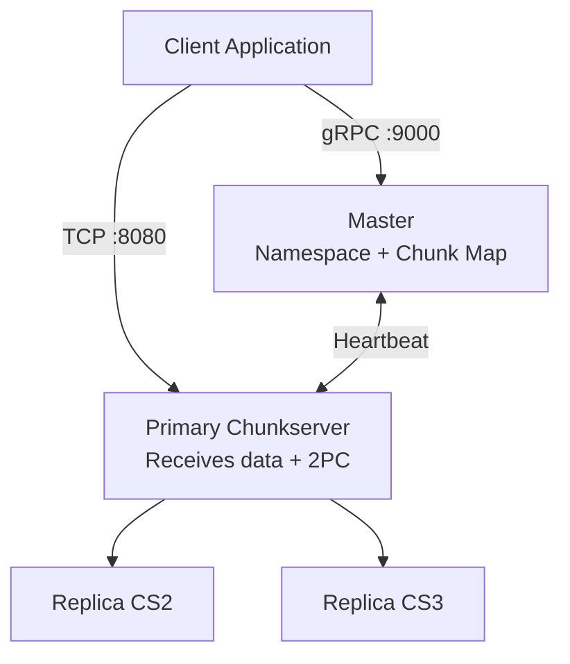
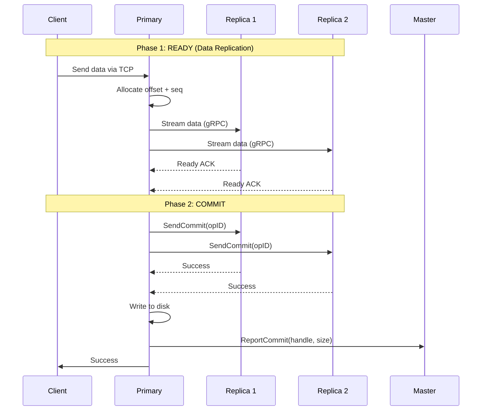
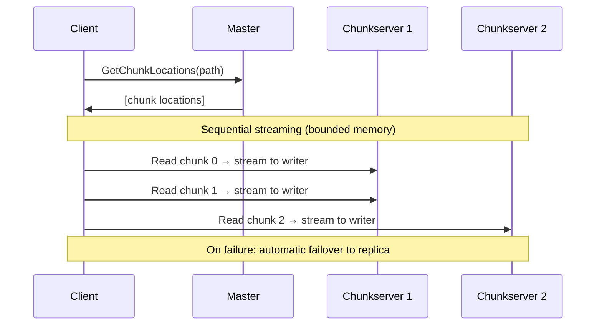

# GFS (Distributed File System)

GFS is a custom implementation of Google File System, providing distributed, replicated file storage for Edd Cloud.

## Architecture



## Key Specifications

| Property | Value |
|----------|-------|
| Chunk Size | 64 MB |
| Replication Factor | 3 |
| Write Quorum | 2 of 3 |
| Consistency | Strong (2PC) |
| Chunk Handle | UUID v4 |

## Components

### Master Server

- Manages file namespace and metadata
- Tracks chunk locations across chunkservers
- Handles chunk allocation for writes
- Persists metadata via Write-Ahead Log (WAL)

### Chunkserver

- Stores actual file data in 64MB chunks
- Participates in Two-Phase Commit for writes
- Reports chunk inventory via heartbeats
- Handles data replication to peers

## Write Flow (Two-Phase Commit)



## Read Flow



### Streaming Architecture

Reads use **sequential streaming** to maintain bounded memory usage:

- Chunks are read one at a time in order
- Data streams directly to the HTTP response (no buffering)
- Memory usage is constant regardless of file size
- On chunk read failure, automatically retries with replica servers

## Sequence Numbers

Each write operation receives a monotonic sequence number to ensure ordering:

- Primary assigns sequence on write
- Replicas buffer out-of-order commits
- Commits applied in sequence order

## SDK Usage

```go
import gfs "eddisonso.com/go-gfs/pkg/go-gfs-sdk"

// Create client with connection pooling
client, err := gfs.New(ctx, "gfs-master:9000",
    gfs.WithConnectionPool(8, 60*time.Second),
)
defer client.Close()

// Write file
err = client.WriteFile(ctx, "/myfile.txt", []byte("hello"))

// Read file (streams directly, no buffering)
data, err := client.ReadFile(ctx, "/myfile.txt")

// Stream large files directly to writer
n, err := client.ReadTo(ctx, "/largefile.bin", responseWriter)

// Append data (double-buffered for throughput)
err = client.AppendFile(ctx, "/myfile.txt", []byte(" world"))

// Delete file
err = client.DeleteFile(ctx, "/myfile.txt")
```

### Connection Pooling

Enable TCP connection pooling to reduce connection overhead:

```go
gfs.WithConnectionPool(maxIdlePerHost, idleTimeout)
```

- Reuses connections across requests
- Validates idle connections before reuse
- Auto-cleanup of stale connections

## Deployment

GFS runs as separate Kubernetes deployments:

- **gfs-master**: Single instance (metadata server)
- **gfs-chunkserver-1/2/3**: One per node (data storage)

Each chunkserver has a PersistentVolumeClaim for data storage.

## Monitoring

Resource metrics available via Master API:

```protobuf
rpc GetClusterPressure(GetClusterPressureRequest)
    returns (GetClusterPressureResponse);
```

Returns CPU, memory, and disk usage for each chunkserver.
