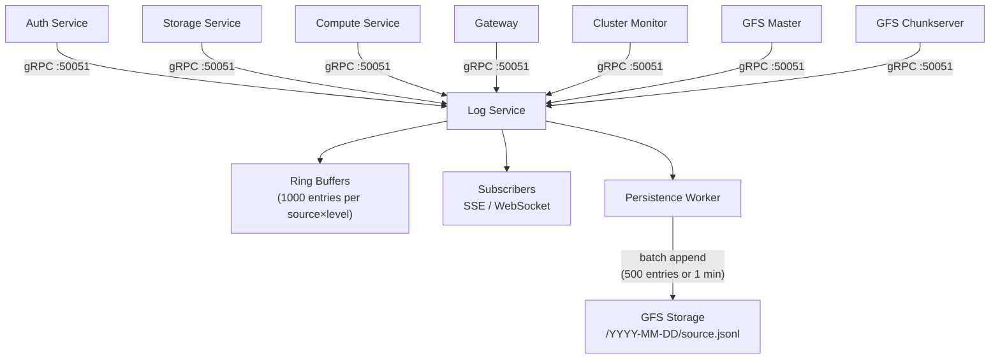

# Log Service

The Log Service provides centralized logging for all Edd Cloud services with real-time streaming capabilities.

## Features

- **Centralized Collection**: All services send logs via gRPC
- **Real-time Streaming**: SSE and WebSocket log streaming to the dashboard
- **Log Levels**: DEBUG, INFO, WARN, ERROR
- **Source Filtering**: Filter logs by service/pod name
- **GFS Persistence**: Async, best-effort log persistence to GFS

## Architecture



## Storage Model

Logs are stored in two layers:

### In-Memory Ring Buffers (primary)

Each unique source + level combination gets its own circular buffer holding up to **1000 entries**. These are the primary serving layer — subscribers receive recent entries from ring buffers on connect, then live updates via pub/sub broadcast.

- **Ephemeral**: Lost on pod restart
- **Per-replica**: Each log-service pod has independent buffers

### GFS Persistence (async, best-effort)

Log entries are queued to an internal channel (capacity: 1000). A background worker batches entries and appends them to GFS as JSONL files organized by date and source:

```
/core-logs/2026-02-08/gateway.jsonl
/core-logs/2026-02-08/cluster-monitor.jsonl
/core-logs/2026-02-08/auth-service.jsonl
```

| Setting | Value |
|---------|-------|
| Batch size | 500 entries |
| Flush interval | 1 minute |
| GFS namespace | `core-logs` |
| Queue capacity | 1000 entries |
| Overflow behavior | Silent drop |

If GFS is unavailable at startup, persistence is disabled and logs are kept in memory only.

### Limitations

- No log replay from GFS on startup — ring buffers start empty after a pod restart
- Each log-service replica has independent ring buffers (no cross-replica sharing)
- Persistence queue drops entries silently when full

## Client Library

Services use the `gfslog` package to send logs:

```go
import "eddisonso.com/go-gfs/pkg/gfslog"

logger := gfslog.NewLogger(gfslog.Config{
    Source:         "my-service",
    LogServiceAddr: "log-service:50051",
    MinLevel:       slog.LevelDebug,
})
slog.SetDefault(logger.Logger)
defer logger.Close()

// Now use standard slog
slog.Info("Service started", "port", 8080)
slog.Error("Connection failed", "error", err)
```

## API Endpoints

### gRPC (Internal)

| Method | Description |
|--------|-------------|
| `PushLog(PushLogRequest)` | Send a log entry |
| `StreamLogs(StreamLogsRequest)` | Stream logs (server-side streaming) |
| `GetLogs(GetLogsRequest)` | Query recent log entries |

### HTTP/SSE (External)

| Endpoint | Description |
|----------|-------------|
| `GET /sse/logs` | Stream logs via SSE |
| `GET /sse/logs?source=<name>` | Filter by source |
| `GET /sse/logs?level=<level>` | Filter by minimum level |

## Log Entry Format

```json
{
  "timestamp": 1707350096,
  "level": 1,
  "source": "edd-storage",
  "message": "Request processed",
  "attributes": {
    "method": "GET",
    "path": "/storage/files",
    "duration": "15ms"
  }
}
```

## Log Levels

| Level | Value | Description |
|-------|-------|-------------|
| DEBUG | 0 | Detailed debugging information |
| INFO | 1 | General operational messages |
| WARN | 2 | Warning conditions |
| ERROR | 3 | Error conditions |

## Frontend Integration

The dashboard streams logs via SSE:

```javascript
const params = new URLSearchParams();
params.set('source', 'edd-storage');
params.set('level', 'INFO');

const eventSource = new EventSource(`/sse/logs?${params}`);

eventSource.onmessage = (event) => {
  const entry = JSON.parse(event.data);
  console.log(`[${entry.source}] ${entry.message}`);
};
```

## Configuration

| Flag | Description | Default |
|------|-------------|---------|
| `-grpc` | gRPC listen address | `:50051` |
| `-http` | HTTP listen address | `:8080` |
| `-master` | GFS master address | `gfs-master:9000` |
