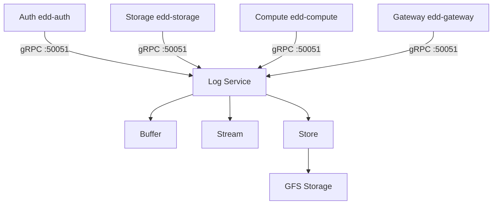

# Log Service

The Log Service provides centralized logging for all Edd Cloud services with real-time streaming capabilities.

## Features

- **Centralized Collection**: All services send logs to a single endpoint
- **Real-time Streaming**: SSE-based log streaming to clients
- **Log Levels**: DEBUG, INFO, WARN, ERROR
- **Source Filtering**: Filter logs by service/pod name
- **Persistent Storage**: Logs stored in GFS

## Architecture



## Client Library

Services use the `gfslog` package to send logs:

```go
import "eddisonso.com/go-gfs/pkg/gfslog"

logger := gfslog.NewLogger(gfslog.Config{
    Source:         "my-service",
    LogServiceAddr: "log-service:50051",
    MinLevel:       slog.LevelDebug,
})
slog.SetDefault(logger.Logger)
defer logger.Close()

// Now use standard slog
slog.Info("Service started", "port", 8080)
slog.Error("Connection failed", "error", err)
```

## API Endpoints

### gRPC (Internal)

| Method | Description |
|--------|-------------|
| `Log(LogRequest)` | Send a log entry |
| `StreamLogs(StreamRequest)` | Stream logs (server-side) |

### HTTP/SSE (External)

| Endpoint | Description |
|----------|-------------|
| `GET /sse/logs` | Stream logs via SSE |
| `GET /sse/logs?source=<name>` | Filter by source |
| `GET /sse/logs?level=<level>` | Filter by minimum level |

## Log Entry Format

```json
{
  "timestamp": "2024-01-19T12:34:56.789Z",
  "level": 1,
  "source": "edd-storage",
  "message": "Request processed",
  "fields": {
    "method": "GET",
    "path": "/storage/files",
    "duration": "15ms"
  }
}
```

## Log Levels

| Level | Value | Description |
|-------|-------|-------------|
| DEBUG | 0 | Detailed debugging information |
| INFO | 1 | General operational messages |
| WARN | 2 | Warning conditions |
| ERROR | 3 | Error conditions |

## Frontend Integration

The dashboard streams logs via SSE:

```javascript
const params = new URLSearchParams();
params.set('source', 'edd-storage');
params.set('level', 'INFO');

const eventSource = new EventSource(`/sse/logs?${params}`);

eventSource.onmessage = (event) => {
  const entry = JSON.parse(event.data);
  console.log(`[${entry.source}] ${entry.message}`);
};
```

## Configuration

| Flag | Description | Default |
|------|-------------|---------|
| `-grpc` | gRPC listen address | `:50051` |
| `-http` | HTTP listen address | `:8080` |
| `-master` | GFS master address | - |
