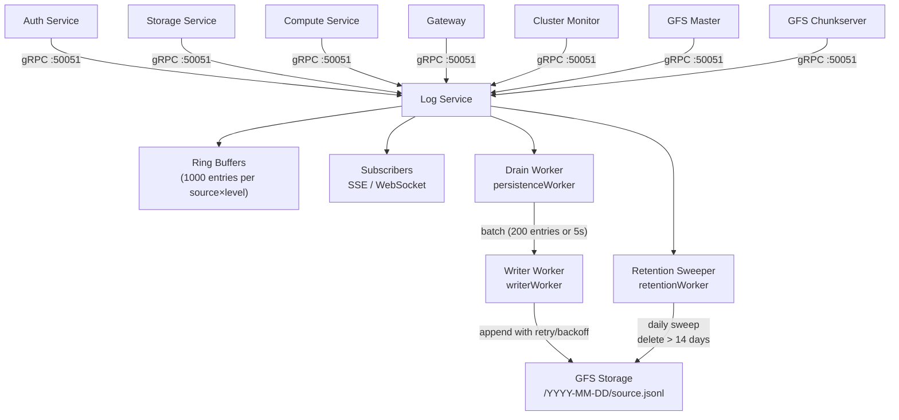

# Log Service

The Log Service provides centralized logging for all Edd Cloud services with real-time streaming capabilities.

## Features

- **Centralized Collection**: All services send logs via gRPC
- **Real-time Streaming**: SSE and WebSocket log streaming to the dashboard
- **Log Levels**: DEBUG, INFO, WARN, ERROR
- **Source Filtering**: Filter logs by service/pod name
- **GFS Persistence**: Async, durable persistence of Warn+ logs to GFS with automatic 14-day retention

## Architecture


```mermaid
flowchart TB
    Auth[Auth Service] -->|gRPC :50051| LS[Log Service]
    Storage[Storage Service] -->|gRPC :50051| LS
    Compute[Compute Service] -->|gRPC :50051| LS
    Gateway[Gateway] -->|gRPC :50051| LS
    CM[Cluster Monitor] -->|gRPC :50051| LS
    GFSMaster[GFS Master] -->|gRPC :50051| LS
    GFSChunk[GFS Chunkserver] -->|gRPC :50051| LS

    LS --> RB["Ring Buffers<br/>(1000 entries per source×level)"]
    LS --> Sub[Subscribers<br/>SSE / WebSocket]
    LS --> PW[Drain Worker<br/>persistenceWorker]
    LS --> RET[Retention Sweeper<br/>retentionWorker]

    PW -->|"batch (200 entries or 5s)"| WW[Writer Worker<br/>writerWorker]
    WW -->|"append with retry/backoff"| GFS[GFS Storage<br/>/YYYY-MM-DD/source.jsonl]
    RET -->|"daily sweep<br/>delete > 14 days"| GFS
```

## Storage Model

Logs are stored in two layers:

### In-Memory Ring Buffers (primary)

Each unique source + level combination gets its own circular buffer holding up to **1000 entries**. These are the primary serving layer — subscribers receive recent entries from ring buffers on connect, then live updates via pub/sub broadcast.

- **Ephemeral**: Lost on pod restart
- **Per-replica**: Each log-service pod has independent buffers

### GFS Persistence (Warn+ only, durable)

Only `Warn` and above (`WARN`, `ERROR`) are persisted to GFS. `DEBUG` and `INFO` entries are live-only and never written to storage. Warn+ entries are **never dropped**: the enqueue blocks (with shutdown escape) rather than discarding entries when the buffer is full.

A background drain worker batches entries and hands them to a dedicated writer goroutine that appends to GFS with exponential-backoff retry. The writer never discards a batch on error — it retries the same batch until GFS accepts it or the service shuts down. One writer goroutine ensures appends to each `/<date>/<source>.jsonl` file remain ordered.

A daily retention sweeper runs on startup and every 24 hours, deleting archived log files strictly older than 14 days.

```
/core-logs/2026-02-08/gateway.jsonl
/core-logs/2026-02-08/cluster-monitor.jsonl
/core-logs/2026-02-08/auth-service.jsonl
```

| Setting | Value |
|---------|-------|
| Persisted levels | `WARN` and above |
| Batch size | 200 entries |
| Flush interval | 5 seconds |
| GFS namespace | `core-logs` |
| Queue capacity | 10 000 entries |
| Overflow behavior | Blocking (backpressure) |
| Retry behavior | Exponential backoff, max 30s, never drops |
| Retention | 14 days (daily sweep) |

If GFS is unavailable at startup, persistence is disabled and logs are kept in memory only.

### Limitations

- No log replay from GFS on startup — ring buffers start empty after a pod restart
- Each log-service replica has independent ring buffers (no cross-replica sharing)
- `DEBUG` and `INFO` entries are never persisted to GFS; they exist only in the in-memory ring buffers

## Security Audit Trail

Backend services emit structured **audit events** at security-relevant points. Audit events are ordinary log entries that carry an `audit=true` attribute. The log-service persistence filter treats this attribute as an override: any entry that is either `Warn+` **or** `audit`-marked is archived to GFS. This means audit events are **always persisted** (14-day retention), even when their severity is `Info`.

### What Is Audited

| Category | Events |
|----------|--------|
| Authentication | Login success/failure, logout, 2FA success/failure |
| Authorization | All previously-silent `403` denials from compute and sfs |
| Credential lifecycle | API token issue/revoke, passkey register/remove, password change |
| Privileged actions | User create/update/delete, service-account create/update/delete |
| Resource actions | Container create/delete, terminal session open/close, file delete, namespace visibility change |
| Registry operations | Image push, image pull, image delete |
| Gateway rejects | SSH connection rejected, no-route (unresolvable hostname) |

### Log Level by Outcome

Audit events use outcome-based log levels to keep the live default view useful:

| `outcome` value | Log level | Effect |
|-----------------|-----------|--------|
| `denied` | `WARN` | Appears in live Warn view; alert-eligible |
| `failure` | `WARN` | Appears in live Warn view; alert-eligible |
| `success` | `INFO` | Archived via `audit` marker; excluded from the noisy live default view |

### Standard Fields

Every audit event includes the following fields in its `attributes` object:

| Field | Description | Example |
|-------|-------------|---------|
| `audit` | Always `true`; marks the entry for guaranteed persistence | `true` |
| `action` | Namespaced verb describing the operation | `authz.denied`, `token.issue`, `container.create` |
| `outcome` | Result of the action | `success`, `failure`, `denied` |
| `actor` | User ID, service-account ID, or `anonymous` | `user:42`, `sa:ci-runner`, `anonymous` |
| `client_ip` | Source IP of the request, when available | `203.0.113.55` |
| `request_id` | Correlates the event end-to-end via the gateway's `X-Request-ID` header | `req_01j9...` |
| `resource` | The object being acted on | `container:abc123`, `token:tk_xyz`, `image:registry.cloud.eddisonso.com/user/app:v2` |

:::note Never-logged
Audit events intentionally never contain secrets. Only identifiers are recorded — usernames, token IDs, key fingerprints, image references. Credentials, raw tokens, and passwords never appear in log output.
:::

### Example Audit Entry

A denied authorization event from the compute service:

```json
{
  "timestamp": 1750549200,
  "level": 2,
  "source": "edd-compute",
  "message": "authorization denied",
  "attributes": {
    "audit": true,
    "action": "authz.denied",
    "outcome": "denied",
    "actor": "user:17",
    "client_ip": "203.0.113.55",
    "request_id": "req_01j9xk2mq3v4w5n6p7r8s9t0u",
    "resource": "container:c8f2a1b3d4e5"
  }
}
```

### Retrieving Audit Events

Audit events are stored in the normal log archive alongside all other `Warn+` entries — no separate pipeline or storage path is required.

**Download a full day's audit log:**

```
GET https://health.cloud.eddisonso.com/logs/download?date=YYYY-MM-DD
Authorization: Bearer <admin-token>
```

The returned `.zip` archive contains a `.jsonl` file. Filter it locally for `audit=true` entries:

```bash
# Extract the jsonl and filter audit events
unzip -p edd-cloud-logs-2026-06-20.zip edd-cloud-logs-2026-06-20.jsonl \
  | jq 'select(.attributes.audit == true)'

# Narrow further to denied/failure outcomes only
unzip -p edd-cloud-logs-2026-06-20.zip edd-cloud-logs-2026-06-20.jsonl \
  | jq 'select(.attributes.audit == true and .attributes.outcome != "success")'
```

**Watch denials and failures in real time** (live stream, Warn filter):

```
GET https://health.cloud.eddisonso.com/sse/logs?level=WARN
Authorization: Bearer <admin-token>
```

All `outcome=denied` and `outcome=failure` audit events surface here because they log at `WARN`.

## Client Library

Services use the `gfslog` package to send logs:

```go
import "eddisonso.com/go-gfs/pkg/gfslog"

logger := gfslog.NewLogger(gfslog.Config{
    Source:         "my-service",
    LogServiceAddr: "log-service:50051",
    MinLevel:       slog.LevelInfo, // Info is the recommended default; set LevelDebug only temporarily for deep debugging so per-operation debug logs are not shipped to the centralized stream
})
slog.SetDefault(logger.Logger)
defer logger.Close()

// Now use standard slog
slog.Info("Service started", "port", 8080)
slog.Error("Connection failed", "error", err)
```

## API Endpoints

### gRPC (Internal)

| Method | Description |
|--------|-------------|
| `PushLog(PushLogRequest)` | Send a log entry |
| `StreamLogs(StreamLogsRequest)` | Stream logs (server-side streaming) |
| `GetLogs(GetLogsRequest)` | Query recent log entries |

### HTTP/SSE and WebSocket (External)

| Endpoint | Auth | Description |
|----------|------|-------------|
| `GET /sse/logs` | JWT required (admin only) | Stream logs via SSE |
| `GET /sse/logs?source=<name>` | JWT required (admin only) | Filter by source name |
| `GET /sse/logs?level=<level>` | JWT required (admin only) | Filter by minimum level |
| `WS /ws/logs` | JWT required (admin only) | Stream logs via WebSocket |
| `GET /logs/download?date=YYYY-MM-DD` | JWT required (admin only) | Download a day's logs (all sources, merged) as a .zip containing .log + .jsonl |

The download endpoint returns a `.zip` archive containing two files: a human-readable `edd-cloud-logs-<date>.log` and a raw `edd-cloud-logs-<date>.jsonl`, both containing entries from all sources merged and sorted chronologically for the requested UTC date. The token may be passed via the `Authorization` header or the `?token=` query parameter (same as `/ws/logs`). Returns `400` for a malformed date and `404` if no logs exist for that date.

:::warning Phase 1 — Admin-only log access
Log streaming currently requires a valid JWT with admin privileges. Because log entries do not yet carry per-user or per-namespace ownership data, non-admin users cannot be scoped to their own container logs at this time.

Per-user log streaming is planned for Phase 2, which will add a `namespace` field to log entries so that non-admin users can stream logs from their own `compute-{userID}-*` containers. This requires coordinated changes across all log-producing services.
:::

## Log Entry Format

```json
{
  "timestamp": 1707350096,
  "level": 1,
  "source": "edd-storage",
  "message": "Request processed",
  "attributes": {
    "method": "GET",
    "path": "/storage/files",
    "duration": "15ms"
  }
}
```

## Log Levels

| Level | Value | Description |
|-------|-------|-------------|
| DEBUG | 0 | Detailed debugging information |
| INFO | 1 | General operational messages |
| WARN | 2 | Warning conditions |
| ERROR | 3 | Error conditions |

## Frontend Integration

The dashboard streams logs via SSE:

```javascript
const params = new URLSearchParams();
params.set('source', 'edd-storage');
params.set('level', 'INFO');

const eventSource = new EventSource(`/sse/logs?${params}`);

eventSource.onmessage = (event) => {
  const entry = JSON.parse(event.data);
  console.log(`[${entry.source}] ${entry.message}`);
};
```

## Configuration

| Flag | Description | Default |
|------|-------------|---------|
| `-grpc` | gRPC listen address | `:50051` |
| `-http` | HTTP listen address | `:8080` |
| `-master` | GFS master address | `gfs-master:9000` |
