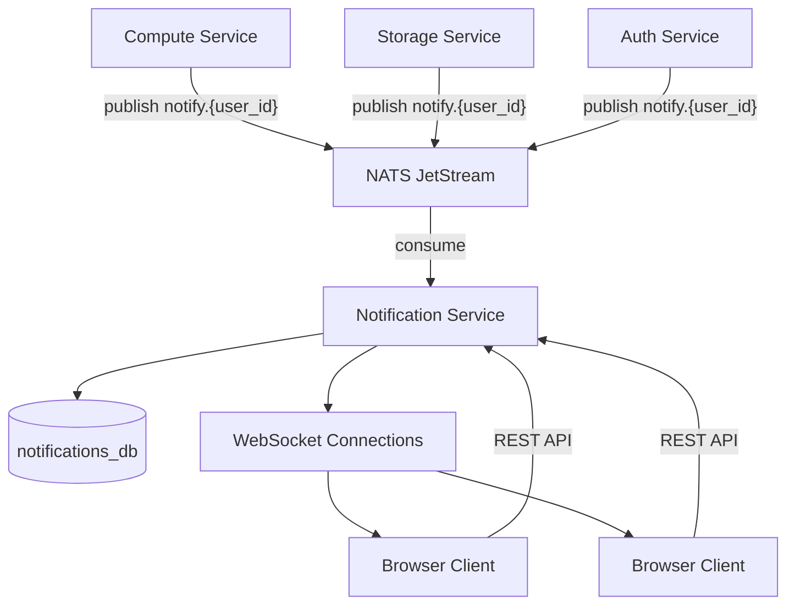

# Notification Service

The Notification Service provides real-time push notifications across Edd Cloud. It consumes events from other services via NATS, persists them in PostgreSQL, and delivers them to connected clients over WebSocket.

## Features

- **Event-Driven Ingestion**: Receives notification events from services via NATS JetStream
- **Persistent Storage**: Stores all notifications in PostgreSQL for retrieval
- **Real-time Push**: Delivers notifications to connected clients via WebSocket
- **REST API**: Paginated listing, unread counts, and read status management
- **JWT Authentication**: All endpoints require a valid JWT

## Architecture



## Message Flow

1. A service (compute, storage, auth) publishes a protobuf-encoded notification to NATS on subject `notify.{user_id}`.
2. The notification service consumer receives the message from the `NOTIFICATIONS` stream.
3. The message is deserialized and inserted into the `notifications` table in PostgreSQL.
4. If the target user has an active WebSocket connection, the notification is broadcast to all of their connected clients in real time.
5. The NATS message is acknowledged after successful database insertion.

If the database insert fails, the message is NAK'd and will be redelivered (up to 5 attempts).

## API Endpoints

### REST

All REST endpoints require a `Bearer` JWT in the `Authorization` header.

| Method | Path | Description |
|--------|------|-------------|
| `GET` | `/api/notifications` | List notifications for authenticated user |
| `GET` | `/api/notifications/unread-count` | Get count of unread notifications |
| `POST` | `/api/notifications/{id}/read` | Mark a specific notification as read |
| `POST` | `/api/notifications/read-all` | Mark all notifications as read |
| `GET` | `/healthz` | Health check |

### WebSocket

| Path | Description |
|------|-------------|
| `GET /ws/notifications` | Real-time notification stream |

## Pagination

The `GET /api/notifications` endpoint supports pagination via query parameters:

| Parameter | Type | Default | Max | Description |
|-----------|------|---------|-----|-------------|
| `limit` | int | 20 | 100 | Number of notifications to return |
| `offset` | int | 0 | - | Number of notifications to skip |

Notifications are returned ordered by `created_at DESC` (newest first).

## Response Formats

### Notification Object

```json
{
  "id": 42,
  "user_id": "abc123",
  "title": "Container Ready",
  "message": "Container 'dev-box' is now running",
  "link": "/compute/containers/abc",
  "category": "compute",
  "read": false,
  "created_at": "2026-02-08T14:30:00Z"
}
```

### Unread Count

```json
{
  "count": 5
}
```

### Mark Read / Mark All Read

```json
{
  "status": "ok"
}
```

## WebSocket Connection

Clients connect to `/ws/notifications` to receive real-time push notifications. Authentication is provided via a `token` query parameter or a `Bearer` token in the `Authorization` header.

```javascript
const ws = new WebSocket(
  `wss://cloud.eddisonso.com/ws/notifications?token=${jwt}`
);

ws.onmessage = (event) => {
  const notification = JSON.parse(event.data);
  console.log(`[${notification.category}] ${notification.title}`);
};
```

### Connection Limits

- Maximum **5** concurrent WebSocket connections per user
- Connections exceeding the limit are immediately closed
- Origin validation restricts connections to `*.cloud.eddisonso.com`
- Closed or failed connections are automatically cleaned up

## NATS Integration

### Stream Configuration

| Setting | Value |
|---------|-------|
| Stream name | `NOTIFICATIONS` |
| Subject pattern | `notify.>` |
| Retention | Limits policy |
| Max messages | 1,000,000 |
| Max bytes | 1 GB |
| Max age | 7 days |
| Storage | File |

### Consumer Configuration

| Setting | Value |
|---------|-------|
| Consumer name | `notification-service` |
| Durable | Yes |
| Ack policy | Explicit |
| Ack wait | 30 seconds |
| Max redeliveries | 5 |
| Deliver policy | All |

### Protobuf Message Format

Notifications are published as protobuf-encoded messages using the `Notification` message type:

```protobuf
message Notification {
  EventMetadata metadata = 1;
  string user_id = 2;
  string title = 3;
  string message = 4;
  string link = 5;
  string category = 6;
}
```

### Publishing from Other Services

Services use the `publisher` package to send notifications:

```go
import "eddisonso.com/notification-service/pkg/publisher"

pub, err := publisher.New(natsURL, "my-service")
if err != nil {
    log.Fatal(err)
}
defer pub.Close()

err = pub.Notify(ctx, userID, "Container Ready",
    "Container 'dev-box' is now running",
    "/compute/containers/abc",
    "compute",
)
```

## Notification Categories

| Category | Source | Examples |
|----------|--------|----------|
| `compute` | Compute Service | Container started, container stopped, build completed |
| `storage` | Storage Service | Upload completed, namespace created |
| `auth` | Auth Service | Password changed, new login detected |

## Database Schema

```sql
CREATE TABLE notifications (
    id BIGSERIAL PRIMARY KEY,
    user_id TEXT NOT NULL,
    title TEXT NOT NULL,
    message TEXT NOT NULL,
    link TEXT NOT NULL DEFAULT '',
    category TEXT NOT NULL DEFAULT '',
    read BOOLEAN NOT NULL DEFAULT false,
    created_at TIMESTAMP DEFAULT CURRENT_TIMESTAMP
);

CREATE INDEX idx_notifications_user_unread
    ON notifications (user_id, read, created_at DESC);
```

The composite index on `(user_id, read, created_at DESC)` optimizes the most common query patterns: listing a user's notifications and counting unread items.

## Configuration

| Flag | Description | Default |
|------|-------------|---------|
| `-addr` | HTTP listen address | `:8080` |
| `-log-service` | Log service gRPC address | (disabled) |

| Env Variable | Description | Required |
|-------------|-------------|----------|
| `DATABASE_URL` | PostgreSQL connection string | Yes |
| `JWT_SECRET` | Secret for validating JWTs | Yes |
| `NATS_URL` | NATS server URL | No (default: `nats://nats:4222`) |

## Health Check

```
GET /healthz -> 200 OK
```
